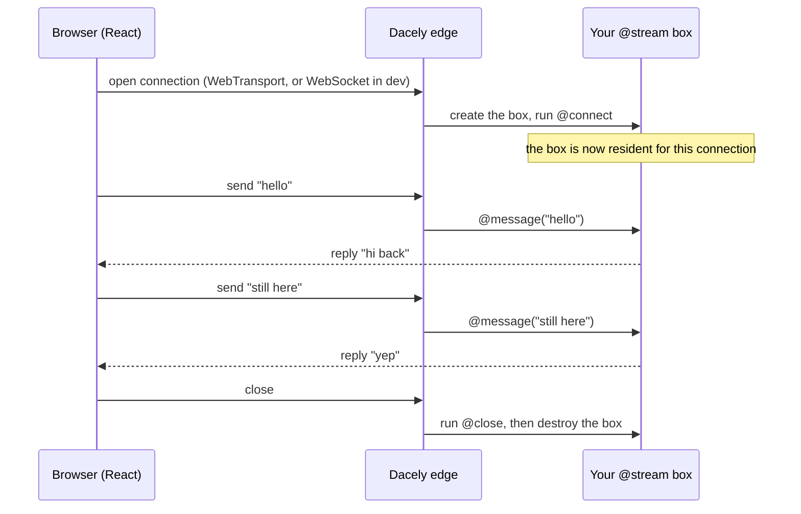
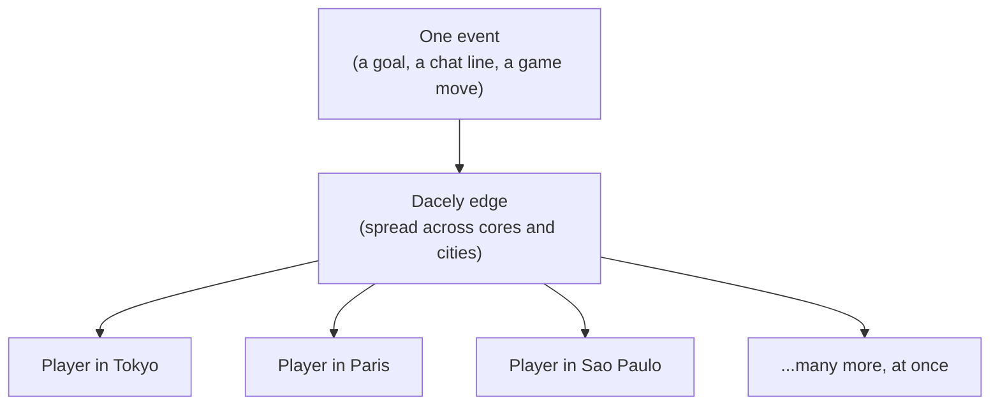

# Realtime

Realtime is how your app pushes data to the browser the instant it happens, instead of the browser having to ask again and again. In toiljs you get realtime from two small pieces: a server class marked `@stream`, and a client React hook called `useChannel`.

## What "realtime" means

A normal web request is one round trip. The browser asks ("give me the todos"), the server answers, and the connection closes. If you want fresh data a second later, you have to ask again. That is fine for a page load or a form submit, but it is a poor fit for anything that changes on its own: a live chat, a game, a price ticker, a progress bar, a presence indicator ("3 people online").

Realtime flips it around. The browser opens **one long-lived connection** and keeps it open. After that, either side can send a message at any time, as many times as it likes, with no new handshake. That open connection is often called a **socket**.

## WebTransport in plain words

To hold that long-lived connection open, the browser and the Dacely edge speak a protocol called **WebTransport**.

Here is all you need to know as a beginner:

- WebTransport is a modern, built-in browser feature (like `fetch`, but for a persistent two-way connection).
- It runs on top of **HTTP/3** and **QUIC**, which are the newest, fastest versions of the web's plumbing. They are built for low latency (messages arrive quickly) and for surviving network changes (your phone switching from Wi-Fi to cellular without dropping the connection).
- You do not write any WebTransport code by hand. toiljs gives you a tiny client API, and it uses WebTransport underneath on the production edge.

One helpful detail for later: in local development (`toiljs dev`) the same client API runs over a **WebSocket** instead, because a WebSocket is simpler to serve from one local process. A WebSocket is the older, widely supported "keep a socket open" browser feature. The point is that **your code is identical** in dev and in production; only the transport underneath differs, and toiljs picks it for you.

## When to use realtime (and when not to)

Reach for realtime when **the server needs to talk first**, or when messages fly back and forth quickly:

| Use realtime when...                          | Use a plain HTTP request when...                 |
| --------------------------------------------- | ------------------------------------------------ |
| A chat or comment thread updates live.        | You load a page or a list once.                  |
| A multiplayer game syncs moves and positions. | You submit a form and get one answer.            |
| You show live presence or typing indicators.  | You fetch data on a button click.                |
| You stream progress of a long job.            | The data rarely changes, or the user pulls it.   |

**Games are a first-class use case, not an afterthought.** Realtime multiplayer (player moves, low-latency input, live presence, per-player state) is one of the hardest things to build on the plain web, and it is exactly what toil streaming is designed for. More on why, and how far it is built to scale, in [Built for massive fan-out and world-wide sync](#built-for-massive-fan-out-and-world-wide-sync) below.

If a single request-and-response does the job, prefer that: it is simpler, it caches well, and it needs no open connection. Plain requests in toiljs are [HTTP routes](../backend/rest.md) and [typed RPC](../backend/rpc.md). Reach for realtime only when the "ask again and again" model genuinely gets in your way.

## The two pieces

Realtime in toiljs is always a pair:

1. **The server: a `@stream` class.** You write a small class and mark it `@stream`. The edge turns it into a **resident box**: a live instance that is created when a connection opens, handles every message on that connection, and is torn down when it closes. It has four lifecycle hooks (`@connect`, `@message`, `@close`, `@disconnect`). See [Streams](./streams.md).

2. **The client: a hook.** From your React UI you open the connection and send or receive messages. The low-level way is the `useChannel` hook; the typed, generated way is `Server.Stream.<ClassName>.connect()`. See [Channels](./channels.md).

Notice that the box lives across **many** messages in that diagram. That is the whole idea: because it is the same instance every time, it can remember things between messages (a counter, who you are, what room you joined). A normal HTTP handler forgets everything after each request; a stream box does not, for as long as the connection stays open.

## Built for massive fan-out and world-wide sync

Realtime gets exciting when a single event reaches **many** people at nearly the same moment. Picture a live sports app: a goal is scored, and every fan watching sees it light up together. Picture a multiplayer game: one player moves, and everyone in the match sees it happen right away. That shape, one event fanning out to a huge live audience, is what toil streaming is built for. We call it **world-wide packet sync**: everyone in the same live session gets the same update at nearly the same time, wherever they are on the planet.

### Why it can go so wide

Three real mechanisms make massive scale possible. None of them is magic: each is plain engineering you can read in the edge source.

1. **Every connection lands on a worker core, in parallel.** The edge runs many worker cores per machine, each pulling packets straight from the network card in userspace (a technique called kernel-bypass, or DPDK). A connection is pinned to one core by writing that core's id **into the QUIC connection id**, a trick called **CID-steering** (a connection id is the label QUIC puts on every packet of a connection; QUIC is the fast, modern transport under HTTP/3). New connections spread evenly across all the cores, and there is no shared lock in the middle for them to fight over. Adding cores adds capacity.
2. **The session follows the user.** Because the core id travels inside the connection id, a phone that switches from Wi-Fi to cellular keeps its exact session on the exact same core, in-memory game state and all. The edge re-routes the moved connection for you, so a network change does not drop the session.
3. **The session sits near the user.** The edge is a fleet of servers in many cities. A `@stream` runs at a regional or continental node (see [Compute tiers](../concepts/tiers.md)), so the round trip to a player stays short no matter where on the map they are.

### An honest word on numbers

The framework is **designed** for very large live audiences, aiming at the scale of millions of concurrent connections in a single live session as its ambition. That is the target the architecture is built toward, not a number measured in these docs. Real capacity depends entirely on your deployment: how many machines and cores you run, how big each message is, how often it is sent, and where your users are. We do not publish a benchmarked figure here. What we can say honestly is **why** it scales (the three mechanisms above), and that the design removes the usual single-machine and single-lock ceilings that cap other realtime stacks.

One more honest note. Fanning a single message out to **other** users' connections (true one-to-many broadcast, the arrows in the diagram above) is the job of `@channel`. The client side of that (`useChannel`, `Server.Stream`) is live today. The server-side broadcast that reaches every subscriber across the mesh is **planned, not shipped yet**. See [Channels](./channels.md) for exactly what works now and what is coming, so you can build on solid ground.

## Where to go next

- [Streams](./streams.md): the server side. How to declare a `@stream` class, the four lifecycle hooks, per-connection state, replying, and the separate `main.stream.ts` file.
- [Channels](./channels.md): the client side. The `useChannel` React hook, the generated typed client, and a chat-style example. Also covers the planned `@channel` broadcast feature.

## Related

- [Compute tiers (L1 to L4)](../concepts/tiers.md): where a stream box runs on the edge.
- [HTTP routes (`@rest`)](../backend/rest.md) and [Typed RPC](../backend/rpc.md): the plain request-and-response alternatives.
- [Daemons](../background/daemons.md): long-lived background work that is not tied to a browser connection.
