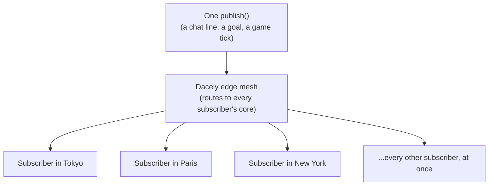

# Channels (`useChannel`)

`useChannel` is the client-side React hook for realtime. It opens a live connection from the browser to a server `@stream` box, tracks whether it is connected, collects the messages that arrive, and gives you a `send` function. It reconnects on its own if the connection drops.

## What a channel is

A **channel** is simply an open, two-way connection between one browser and the server, viewed from the client's side. On the server that connection is handled by a [`@stream`](./streams.md) box. On the client you hold the other end with `useChannel` (a React hook) or `connectChannel` (a plain function, no React).

You have already met the two-piece model in the [realtime overview](./README.md): a `@stream` on the server, a channel on the client. This page is the client half.

## The `useChannel` hook

`useChannel` is available on the global `Toil` object in your route files, so no import is needed:

```tsx
export default function Ping() {
    const chan = Toil.useChannel({ path: '/echo' });

    return (
        <main>
            <p>Status: <strong>{chan.connected ? 'connected' : 'offline'}</strong></p>
            <button type="button" onClick={() => chan.send('ping')}>Send ping</button>
            <ul>
                {chan.messages.map((m, i) => (
                    <li key={i}><code>{typeof m === 'string' ? m : '(binary frame)'}</code></li>
                ))}
            </ul>
        </main>
    );
}
```

### What it returns

`useChannel(options?)` returns an object with three things:

| Field       | Type                       | What it is                                                              |
| ----------- | -------------------------- | ---------------------------------------------------------------------- |
| `connected` | `boolean`                  | `true` while the socket is open. Re-renders when it changes.           |
| `messages`  | `(string \| ArrayBuffer)[]`| every frame received so far, in order. A new frame re-renders.         |
| `send`      | `(data) => void`           | send one frame to the server (a no-op until the socket is open).       |

A frame is either a **string** (text) or an **`ArrayBuffer`** (binary). Send accepts a string or binary data. To send or read structured data, encode and decode it yourself:

```ts
chan.send(new TextEncoder().encode('hello'));           // send bytes
const text = (m: string | ArrayBuffer) =>
    typeof m === 'string' ? m : new TextDecoder().decode(m); // read either kind as text
```

### Options

```ts
Toil.useChannel({
    path: '/echo',        // which @stream route to connect to. Default: '/_toil'
    url: 'wss://...',     // full ws(s):// override (wins over path). Usually omit this.
    reconnect: true,      // auto-reconnect after an unexpected close. Default: true
    reconnectDelay: 1000  // ms to wait before each reconnect attempt. Default: 1000
});
```

The most important option is **`path`**: it points the channel at a specific `@stream` route. `{ path: '/echo' }` connects to a stream mounted with `@stream('echo')`. If you omit `path`, it connects to the default `/_toil` channel.

You do not build the `ws://` or `wss://` URL yourself. The hook derives it from the current page (a page served over `https` uses `wss`, otherwise `ws`), and on the production edge the transport is upgraded to WebTransport for you. Your code stays the same.

### Lifecycle and cleanup

`useChannel` connects when the component mounts and closes when it unmounts, so a channel lives exactly as long as the page that uses it is on screen. React's rules apply: call it at the top level of your component, not inside a loop or condition.

### `connectChannel`: the non-React version

If you need a channel outside a React component (in a plain module, a store, an event handler), use `connectChannel`. It takes a callback for each incoming frame and returns a handle:

```ts
import { connectChannel } from 'toiljs/client';

const chan = connectChannel(
    (frame) => console.log('got', frame),
    { path: '/echo' }
);
chan.send('hello');
chan.close(); // stop and stop reconnecting
```

`useChannel` is `connectChannel` wrapped for React (it manages the `connected` / `messages` state for you).

## The typed client: `Server.Stream`

`useChannel` deals in raw frames. For a typed experience, toiljs also generates a client per `@stream` class at `Server.Stream.<ClassName>`, described in full on the [Streams](./streams.md#reaching-a-stream-from-the-browser) page. Use whichever fits: `useChannel` for a quick reactive hook, `Server.Stream.<Name>.connect()` for typed messages and explicit `onMessage` / `onClose` callbacks. Both open the same kind of connection to the same box.

## A full chat-style example

Here is a chat UI wired end to end: a React page that sends what you type and shows every reply, plus the server box it talks to.

### Client (`client/routes/chat.tsx`)

```tsx
import { useState } from 'react';

export default function Chat() {
    const chan = Toil.useChannel({ path: '/room' });
    const [draft, setDraft] = useState('');

    const asText = (m: string | ArrayBuffer): string =>
        typeof m === 'string' ? m : new TextDecoder().decode(m);

    function submit(): void {
        if (draft.length === 0) return;
        chan.send(draft);   // one send() becomes one @message on the server
        setDraft('');
    }

    return (
        <main>
            <h1>Chat</h1>
            <p>Status: <strong>{chan.connected ? 'connected' : 'offline'}</strong></p>
            <ul>
                {chan.messages.map((m, i) => <li key={i}>{asText(m)}</li>)}
            </ul>
            <input
                value={draft}
                onChange={(e) => setDraft(e.target.value)}
                onKeyDown={(e) => { if (e.key === 'Enter') submit(); }}
                placeholder="Say something"
            />
            <button type="button" onClick={submit}>Send</button>
        </main>
    );
}
```

### Server (`server/streams/Room.ts`)

```ts
@stream('room')
class Room {
    private seen: i32 = 0;

    @connect
    onConnect(): void {
        this.seen = 0;
    }

    @message
    onMessage(packet: StreamPacket): StreamOutbound {
        this.seen = this.seen + 1;
        const text = new TextDecoder().decode(packet.bytes());
        const reply = '#' + this.seen.toString() + ': ' + text;
        return StreamOutbound.reply(Uint8Array.wrap(String.UTF8.encode(reply)));
    }
}
```

Do not forget to import the stream in `server/main.stream.ts` (see [Streams](./streams.md#the-mainstreamts-file-a-separate-tier)):

```ts
import './streams/Room';
```

Run `toiljs dev`, open the page, and every line you send comes back numbered, live.

### An honest limitation: this echoes, it does not broadcast

Read the example carefully. Each browser has its **own** `Room` box, and that box replies only to **its own** connection. So in this version, two people in "the same room" do **not** see each other's messages: each just sees their own, echoed back. That is enough for a private assistant, a progress feed, or a single-player game, but it is **not** a shared chat room where one message reaches everyone.

To send one message to **many** connected users (true broadcast, the heart of a group chat or a live feed), you need the server to **fan out** a message to every subscriber. That is what `@channel` is for.

## `@channel`: server broadcast (not yet available)

> **Status: planned, not live in the current runtime.** A `@stream` class that declares a `@channel` hook is **rejected** by the edge today ("stream channels are not a v1 runtime ABI"), and the compiler does not yet emit it. The information below describes the intended shape so you can plan for it, not an API you can call right now.

The idea is **publish/subscribe** ("pub/sub"), a standard pattern for broadcast:

- A **channel** is a named topic, for example a chat room id.
- A connection **subscribes** to a channel to start receiving everything sent to it.
- Anyone can **publish** a message to the channel, and every subscriber receives it.
- A connection **unsubscribes** (or disconnects) to stop.

With `@channel`, the server box would join a connection to a named topic and publish messages to it, and the edge would deliver each published message to every subscriber across all the connections in that topic, no matter which worker or node each one landed on. That is the missing "one to many" piece that turns the echo example above into a real shared room. The plan already reserves per-plan limits for it (a cap on subscribers per channel and on message size), so the surface is designed; it is the runtime delivery that is not shipped yet.

### The picture: world-wide sync (the design)

When `@channel` ships, one `publish` will fan out across the whole edge mesh, reaching every subscriber wherever they are, at nearly the same moment. That is the **world-wide sync** idea: a live session where everyone sees the same update together, whether they are in the same city or on opposite sides of the planet.



The mechanism meant to make this fast is the same one that already spreads plain connections across the edge: because the edge always knows where each subscriber's connection lives, a broadcast is a direct fan-out to a known set of destinations, not a search for who is listening. For the wider picture, see [Built for massive fan-out and world-wide sync](./README.md#built-for-massive-fan-out-and-world-wide-sync) in the overview.

Keep the status in mind: the diagram above is the **intended shape**. The delivery runtime is not shipped yet, so treat it as the plan, not an API you can call today.

**What you can build today:** anything where each user talks to their own box (assistants, per-user live updates, single-player sync, progress streams). **What needs `@channel`:** shared rooms and one-to-many broadcast. Until it ships, a common workaround is to persist messages to [the database](../database/README.md) and have clients poll or re-read, which is simpler but not instant.

## Gotchas

- **Frames are `string` or `ArrayBuffer`.** Decode binary frames with `TextDecoder`; there is no automatic parsing in `useChannel` (the typed `Server.Stream` client is the structured option).
- **`send` before "connected" is dropped.** It is a no-op until the socket is open. Guard on `chan.connected`, or expect the first eager sends to be lost.
- **`messages` grows forever.** It keeps every frame received. For a long-lived page, slice it or keep your own bounded list.
- **One box per connection.** `useChannel` does not broadcast between users; that is the `@channel` feature described above.

## Related

- [Realtime overview](./README.md): the two-piece model and when to use realtime.
- [Streams](./streams.md): the server `@stream` class this hook talks to.
- [The database (ToilDB)](../database/README.md): where to persist messages that must outlive a connection or reach users who are offline.
