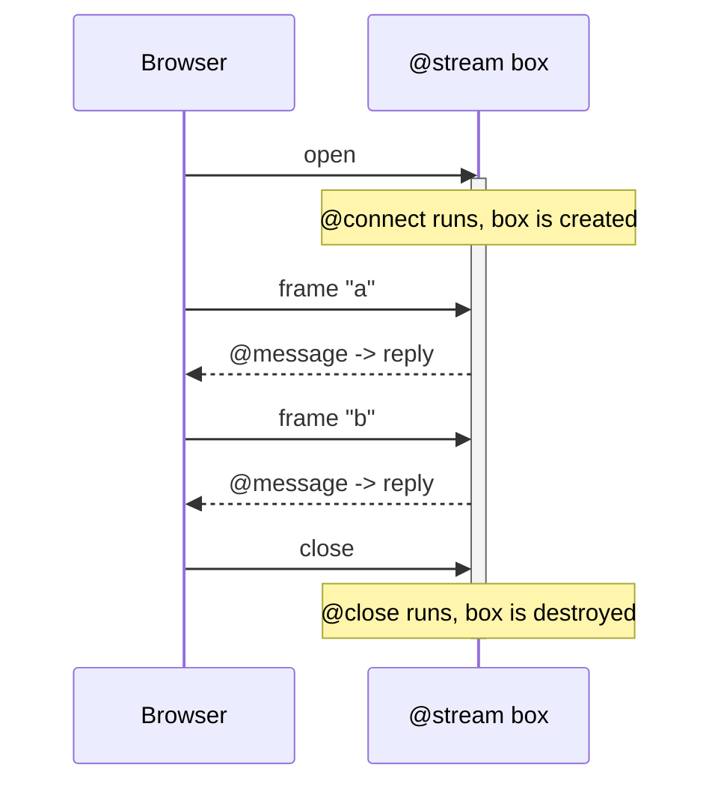

# Streams (`@stream`)

A `@stream` is a server class that handles one live connection from start to finish. You mark a class with `@stream`, add lifecycle hooks, and the Dacely edge keeps one instance of that class alive for as long as the browser stays connected.

## What a stream is (and why it is different)

When you write an [HTTP route](../backend/rest.md), the server builds a **fresh** handler for every request and throws it away afterward. Anything you stored on the handler's fields is gone the moment the response is sent. That is perfect for one-shot requests, but it means the handler cannot "remember" anything between requests on its own.

A `@stream` is the opposite. It is a **resident box**: one live instance, created when a connection opens and kept alive until it closes. Because it is the *same* instance for every message on that connection, values you store on its fields **persist across messages**. That is what makes it the right tool for a conversation, a game session, or anything stateful that lasts for the life of a connection.

The word "resident" just means "stays in memory and keeps running." The word "box" is toiljs's name for one sandboxed instance of your compiled server code.

```ts
@stream('echo')
class Echo {
    private count: i32 = 0;

    @connect
    onConnect(): void {
        this.count = 0; // a fresh connection starts a fresh box, so count begins at 0
    }

    @message
    onMessage(packet: StreamPacket): StreamOutbound {
        this.count = this.count + 1; // survives across messages: same box every time
        const text = 'pong #' + this.count.toString();
        return StreamOutbound.reply(Uint8Array.wrap(String.UTF8.encode(text)));
    }

    @close
    onClose(): void {
        // the box is destroyed after this hook runs
    }
}
```

Connect, send three messages, and you get back `pong #1`, `pong #2`, `pong #3`. The advancing number is proof that the same box handled all three.

## Declaring a stream

Mark a class with `@stream` and give it a **name**. The name becomes the route the browser connects to.

```ts
@stream('echo')       // mounted at /echo
class Echo { /* ... */ }

@stream                // bare form: the route is the class name (/Echo)
class Echo { /* ... */ }
```

There are three forms:

- `@stream('name')`: an explicit mount name (connect at `/name`).
- `@stream` (bare): the mount name is the class name.
- `@stream({ ... })`: a config object (see [Configuration](#configuration) below).

## The four lifecycle hooks

A stream method becomes a lifecycle hook when you tag it with one of these decorators. Every hook is **optional**: declare only the ones you need, and a missing hook is simply a no-op (it does nothing, it never crashes).

| Decorator     | Fires when...                                                            |
| ------------- | ----------------------------------------------------------------------- |
| `@connect`    | the connection opens (the box has just been created).                   |
| `@message`    | an inbound frame arrives from the browser.                              |
| `@close`      | the connection closes cleanly (the box is destroyed after this hook).   |
| `@disconnect` | the connection is lost abruptly (network dropped, browser killed).      |

A **frame** is one message: one call to `send()` on the client becomes one `@message` on the server.



### `@connect`

Runs once, right after the box is created. Use it to set up per-connection state (reset a counter, read the requested path, decide whether to accept the connection). It can return a `StreamOutbound` to accept or reject (see below). The Echo example uses it to zero its counter.

### `@message`

Runs for every inbound frame. This is where most of your logic lives. It receives the frame and may reply. Details in [Reading and replying](#reading-and-replying-to-messages).

### `@close` and `@disconnect`

Both mean "the connection is over," and both are your chance to clean up. The difference is *how* it ended:

- `@close` is a **graceful** close: the browser (or your server) ended it on purpose.
- `@disconnect` is an **abrupt** loss: the network dropped or the tab was killed with no goodbye.

After either one, the box is destroyed.

## Per-connection state (and its limits)

State on the box's fields lasts for **one connection**. It does **not** survive:

- a **reconnect**: if the browser drops and reopens, it gets a brand-new box that starts clean.
- a **different user**: every connection gets its own box, so one connection's state can never leak into another. This is a safety property, not just a convenience.

So treat box fields as **per-connection scratch space** only. For anything that must outlive the connection (a saved message, a score, who a user is across reconnects), write it to [the database](../database/README.md), not to a class field.

## Reading and replying to messages

By default, a `@message` receives a `StreamPacket`, which is a thin view over the raw bytes that arrived, and returns a `StreamOutbound`, which stages the reply.

```ts
@message
onMessage(packet: StreamPacket): StreamOutbound {
    const raw = packet.bytes();               // the inbound frame as bytes
    return StreamOutbound.reply(raw);          // echo the same bytes back
}
```

`StreamPacket` (the inbound frame):

| Member       | What it gives you                                           |
| ------------ | ---------------------------------------------------------- |
| `bytes()`    | the whole frame as a `Uint8Array` (copy it if you keep it). |
| `length`     | the number of bytes in the frame.                          |
| `at(i)`      | the byte at index `i`.                                     |

`StreamOutbound` (what you return):

| Call                          | Meaning                                                             |
| ----------------------------- | ------------------------------------------------------------------ |
| `StreamOutbound.reply(bytes)` | send one frame back to the browser.                                |
| `StreamOutbound.empty()`      | accept the frame and send nothing back.                            |
| `StreamOutbound.reject(code)` | refuse (used from `@connect` to turn a connection away).           |
| `StreamOutbound.accept()`     | accept a connection with no reply frame.                           |

A `@message` may also return `void` when it never replies.

> **Bytes, not strings.** A frame is raw bytes on the wire. To send text, encode it with `String.UTF8.encode(...)` (server) or `new TextEncoder().encode(...)` (browser), and decode it with `new TextDecoder().decode(...)` on the other side.

### Typed messages

Raw bytes are flexible but fiddly. If your messages are structured, declare a [`@data`](../backend/data.md) class and pass it as the stream's `message` type. Your `@message` hook then receives the **decoded object** instead of raw bytes.

```ts
@data
class ChatMsg {
    text: string = '';
    constructor(text: string = '') { this.text = text; }
}

@stream({ message: ChatMsg })
class Chat {
    @message
    onMessage(msg: ChatMsg): StreamOutbound {          // decoded @data, not raw bytes
        const echoed = 'you said: ' + msg.text;
        return StreamOutbound.reply(Uint8Array.wrap(String.UTF8.encode(echoed)));
    }
}
```

The reply is still raw (`StreamOutbound` deals in bytes). Only the **inbound** side is decoded for you. On the client, a typed stream lets you `send(new ChatMsg('hi'))` and toiljs encodes it for you.

## The `main.stream.ts` file (a separate tier)

Streams live in their **own entry file**, `server/main.stream.ts`, separate from the request entry `server/main.ts`. Importing your `@stream` classes there pulls them into a **separate compiled artifact**, `build/server/release-stream.wasm`.

```ts
// server/main.stream.ts
import { revertOnError } from 'toiljs/server/runtime/abort/abort';

import './streams/Echo'; // add each @stream module here as you grow
import './streams/Chat';

// Re-export the WASM entry points the host binds, exactly like main.ts.
export * from 'toiljs/server/runtime/exports';
export function abort(message: string, fileName: string, line: u32, column: u32): void {
    revertOnError(message, fileName, line, column);
}
```

Why a separate file? A stream box and a request handler are **different kinds of program** that run on different parts of the edge (see [Compute tiers](../concepts/tiers.md)). toiljs compiles each into its own `.wasm`:

```sh
$ toiljs build
$ ls build/server/*.wasm
build/server/release.wasm          # L1 request   (@rest / @service)
build/server/release-stream.wasm   # L2/L3 stream  (@stream)
build/server/release-cold.wasm     # L4 daemon     (@daemon)
```

You do not run this by hand. `toiljs build` produces `release-stream.wasm` automatically whenever your project has a `@stream` surface, and shared helper code and `@data` types are compiled into every artifact.

> **One file cannot be both a stream and an RPC surface.** A single source file may not declare both a `@stream` and a `@service` / `@remote` ([RPC](../backend/rpc.md)), because one compiled artifact cannot be two tiers at once. Keep them in separate files: `@stream` in `main.stream.ts`, `@rest` / `@service` in `main.ts`. They coexist happily side by side in the same project, just not in the same file.

## Configuration

The config-object form lets you tune a stream:

```ts
@stream({
    scope: StreamScope.Regional,   // where the box runs (see below)
    message: ChatMsg,              // decode inbound frames into this @data type
    maxFrameBytes: 65536,          // reject frames larger than this
    ingressRingBytes: 262144       // size of the inbound buffer
})
class Chat { /* ... */ }
```

- **`scope`** picks how close to the user the box runs. `StreamScope.Regional` (the default) runs it at a regional node; `StreamScope.Continental` runs it at a wider continental node. See [Compute tiers](../concepts/tiers.md) for what L2 and L3 mean.
- **`message`** is the typed-message shortcut described above.
- **`maxFrameBytes`** and **`ingressRingBytes`** cap frame size and buffer size to protect the box from oversized or flooding input.

## Reaching a stream from the browser

Every `@stream` class gets a generated, typed client at `Server.Stream.<ClassName>`, wired up for you in `shared/server.ts` (the same place the [RPC](../backend/rpc.md) client lands). Call `connect()` to open the connection:

```ts
import '../shared/server'; // attaches globalThis.Server (browser-only)

const chat = await Server.Stream.Echo.connect();
chat.onMessage((bytes) => { /* a reply frame, always raw bytes */ });
chat.send(new TextEncoder().encode('hello'));
chat.onClose((code) => { /* the connection ended */ });
chat.close();
```

The client is keyed by the **class name** (`Server.Stream.Echo`) and connects to the class's **mount route** (`/echo`). Inbound replies are always raw bytes. The full client walkthrough, plus the lower-level `useChannel` hook, is in [Channels](./channels.md).

## How placement works (you do not manage it)

On the production edge, your box is pinned to **one worker** for the connection's whole life, using a QUIC feature called connection-id steering. In plain terms: every message from that connection is routed to the exact machine and process holding your box, so its in-memory state is always there. You never configure this; the edge does it automatically. In `toiljs dev` there is only one process, so this is a non-issue.

## Gotchas

- **Box fields are per-connection only.** They reset on reconnect and are never shared between users. Persist anything durable to [the database](../database/README.md).
- **Frames are bytes.** Encode and decode text yourself, or use a typed `message` so toiljs does it.
- **Copy `packet.bytes()` if you keep it.** The inbound buffer is reused after the hook returns, so store a copy if you need the bytes later.
- **A file cannot mix `@stream` with `@service` / `@remote`.** Keep streams in `main.stream.ts`.
- **`@channel` is not live yet.** A stream that declares a `@channel` hook is rejected by the edge today. Broadcasting to many subscribers is a planned feature; see [Channels](./channels.md).

## Related

- [Realtime overview](./README.md): the big picture and when to reach for realtime.
- [Channels](./channels.md): the client `useChannel` hook and a chat-style example.
- [Compute tiers (L1 to L4)](../concepts/tiers.md): where the stream artifact runs.
- [Data types (`@data`)](../backend/data.md): typed messages.
- [The database (ToilDB)](../database/README.md): where to keep state that outlives a connection.
