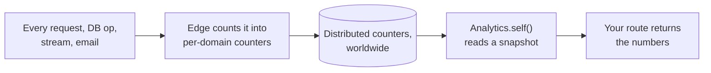

# Analytics

Read your site's own usage numbers (requests, bytes, cache hits, database ops, errors, and more) straight from a route, with no extra code and no third-party service.

Reach for analytics to build a status or usage dashboard for a site: how much traffic it serves, how effective its cache is, how many database operations it runs. It is **infrastructure metering per domain**, not per-user product analytics. There are no custom events; you read a fixed catalog of counters the edge already keeps for you.

`Analytics` is an **ambient global**: use it with no import, like [`crypto`](./crypto.md) or `Time`.

## What "metering" means

Every time the edge (the Dacely server running your code) serves a request, runs a database operation, opens a stream, or sends an email, it **counts** that into a set of per-domain counters. Those counters live in the same worldwide, distributed database that backs [ToilDB](../database/index.md), so the total for your site is correct across every edge location, not just the one machine that happened to serve a request.

`Analytics.self()` reads a **snapshot** of your site's current counter values. You do not record anything yourself; the numbers are already there.



## Read your site's stats

`Analytics.self()` returns a `TenantStats` object. Every counter is a **named getter** that returns a `u64` (an unsigned 64-bit integer, always zero or positive), so mapping the numbers into a response needs no casts at all.

```ts
import { RouteContext } from 'toiljs/server/runtime';

@rest('metrics')
class Metrics {
    @get('/')
    public overview(ctx: RouteContext): string {
        const s = Analytics.self();
        // Every getter is a u64. cacheRatio is the one f64 (a fraction 0..1).
        return `requests=${s.requests} cacheHits=${s.cacheHits} ratio=${s.cacheRatio}`;
    }
}
```

You can also read any counter by its numeric id with `s.metric(MetricId.Requests)`, which returns `0` for an unknown id. The named getters are preferred: they are self-documenting and there are no magic strings to mistype.

### The counter catalog

Every getter below is a lifetime running total: it only ever goes up, and reading it never resets it. They are grouped by area. (`MetricId` is the matching numeric id, an ambient enum you can use with no import.)

**Requests and the L1 edge**

| Getter | What it counts |
| --- | --- |
| `requests` | HTTP requests served |
| `bytesOutL1` | Response bytes sent |
| `bytesInL1` | Request bytes received |
| `status2xx` | 2xx responses (success) |
| `status3xx` | 3xx responses (redirects) |
| `status4xx` | 4xx responses (client errors) |
| `status5xx` | 5xx responses (server errors) |
| `staticHits` | Static assets served without running your code |
| `wasmDispatches` | Times your compiled handler ran |
| `executorFullRejects` | Requests rejected because the worker pool was full |
| `unknownHostRejects` | Requests rejected for an unknown host |
| `rateLimitedRejects` | Requests rejected by rate limiting |
| `gasUsed` | Total compute "gas" your handlers consumed |

**Database (ToilDB)**

| Getter | What it counts |
| --- | --- |
| `dbOps` | Database operations issued |
| `dbReads` | Read operations |
| `dbWrites` | Write operations |
| `dbErrors` | Operations that errored |
| `dbLatencyNsSum` | Summed operation latency, in nanoseconds |
| `meanDbLatencyNs` | Derived: `dbLatencyNsSum / dbOps` (0 with no ops) |

**Streams (WebTransport realtime)**

| Getter | What it counts |
| --- | --- |
| `streamAccepts` | Stream connections accepted |
| `streamRejectWrongNode` | Streams that reached the wrong node |
| `streamRejectCapacity` | Streams rejected for capacity |
| `streamRejectArtifact` | Streams rejected for a missing or invalid build |
| `streamRejectGuest` | Streams your code rejected |
| `streamTraps` | Stream handler crashes |
| `streamIdleTimeouts` | Streams closed for being idle |
| `streamBytesIn` / `streamBytesOut` | Bytes received / sent on streams |
| `streamBackpressureEvents` | Times a stream had to slow down |
| `streamCloses` | Clean closes |
| `streamDisconnects` | Abrupt disconnects |

**Daemons (L4 background jobs)**

| Getter | What it counts |
| --- | --- |
| `daemonStarts` / `daemonStartFailures` | Daemon starts / failed starts |
| `daemonTicksFired` | Scheduled ticks that ran |
| `daemonTicksSkippedNotLeader` | Ticks skipped because this node was not the leader |
| `daemonTicksFailed` | Ticks that failed |
| `daemonLeaderAcquires` / `daemonLeaderFenced` | Leadership gained / lost |
| `daemonHttpCallAttempts` / `daemonHttpCallFailures` | Outbound HTTP calls attempted / failed |

**Memory, email, and cache**

| Getter | What it counts |
| --- | --- |
| `memGrownBytes` | Wasm memory grown, in bytes |
| `emails` | Emails sent |
| `cacheHits` | Responses served from the edge cache |
| `cacheMisses` | Cacheable responses that missed the cache |
| `cacheRatio` | Derived **`f64`**: `cacheHits / (cacheHits + cacheMisses)`, a fraction from 0 to 1 (0 when there were no cacheable responses) |

### Live gauges and request windows

A few fields are not lifetime totals. They still read as `u64`.

**Live gauges** are the current level right now, not a running total:

- `connectedStreams`: streams connected at this moment.
- `committedMemory`: wasm memory committed right now, in bytes.

**Request windows** show your current rate-limit usage against your plan cap (a cap of `0` means unlimited):

- `reqMinuteUsed` / `reqMinuteCap`: requests used and the cap for the current 1-minute window.
- `reqDayUsed` / `reqDayCap`: requests used and the cap for the current 24-hour window.

There is also `nowMs`, the edge wall-clock time (in milliseconds) when the snapshot was taken, so you can show "as of" and compute how fresh the numbers are.

## Time series (for graphs)

The totals above are single numbers. To draw a graph over time, use `Analytics.series(metric, range)`, which returns a `Series`: a list of per-bucket totals from oldest to newest.

```ts
@get('/requests-24h')
public requests24h(ctx: RouteContext): string {
    const s = Analytics.series(MetricId.Requests, AnalyticsRange.H24);
    // s.points        -> per-bucket totals, oldest to newest
    // s.bucketSecs    -> seconds each bucket covers
    // s.headMs        -> end time (ms) of the newest bucket
    // s.ratePerSec(i) -> requests/second for bucket i (points[i] / bucketSecs)
    return `buckets=${s.points.length} bucketSecs=${s.bucketSecs}`;
}
```

`AnalyticsRange` picks the window and the resolution. Short ranges use per-minute buckets for a smooth line; the rest use per-hour buckets (kept for 30 days):

| Range | Span | Bucket width |
| --- | --- | --- |
| `H1` | 1 hour | 1 minute |
| `H6` | 6 hours | 1 minute |
| `H12` | 12 hours | 1 hour |
| `H24` | 24 hours | 1 hour |
| `D3` | 3 days | 1 hour |
| `D7` | 7 days | 1 hour |
| `D14` | 14 days | 1 hour |
| `D30` | 30 days | 1 hour |

The series stores **totals per bucket**, never rates. A rate is derived: `ratePerSec(i)` divides bucket `i` by its width for you, or you can compute `points[i] / bucketSecs` yourself. Most metrics you will chart are counters (`MetricId.Requests`, `MetricId.CacheHits`, and so on).

## Permissions: who can read what

- **Your own site.** `Analytics.self()` and `Analytics.series(...)` always read the site the request landed on. The calling domain is decided by the edge; your code cannot forge it.
- **Cross-site reads are for `dacely.com` only.** The privileged `dacely.com` domain (the platform dashboard) may read any site with `Analytics.site(domain)`, `Analytics.siteSeries(domain, ...)`, and `Analytics.listSites(...)`. For any other caller, or an unknown domain, `site` and `siteSeries` return `null` and `listSites` returns an empty page. There is no way for a normal site to read another site's numbers.

`Analytics.listSites(cursor, limit)` enumerates site names for the dashboard, one page at a time. It returns a `SiteList` with `sites: string[]` and `hasMore: bool`. When `hasMore` is true, pass the last name back as the next `cursor` to get the following page.

```ts
// Only meaningful when the calling domain is dacely.com.
const page = Analytics.listSites('', 100); // first 100 site names
for (let i = 0; i < page.sites.length; i++) {
    const other = Analytics.site(page.sites[i]); // TenantStats | null
    if (other != null) {
        // read other.requests, other.cacheRatio, ...
    }
}
```

## Worked example: return everything

This route reads the full snapshot and maps it into a typed response. Mapping is mechanical: every getter is a `u64` and every response field is a `u64`, so there are no casts. The example groups a representative field from each area; add the rest of the getters from the catalog above the same way.

```ts
import { RouteContext } from 'toiljs/server/runtime';

/** The shape returned to the client. All fields are u64 except the one ratio. */
@data
export class UsageReport {
    // requests / L1
    requests: u64 = 0;
    bytesOut: u64 = 0;
    status2xx: u64 = 0;
    status5xx: u64 = 0;
    gasUsed: u64 = 0;
    // database
    dbOps: u64 = 0;
    dbErrors: u64 = 0;
    meanDbLatencyNs: u64 = 0;
    // cache
    cacheHits: u64 = 0;
    cacheMisses: u64 = 0;
    cacheRatio: f64 = 0;
    // live gauges (current level, not a total)
    connectedStreams: u64 = 0;
    committedMemory: u64 = 0;
    // request windows (cap 0 = unlimited)
    requestsThisMinute: u64 = 0;
    requestsThisMinuteCap: u64 = 0;
    requestsToday: u64 = 0;
    requestsTodayCap: u64 = 0;
    // when the snapshot was read (edge ms)
    nowMs: u64 = 0;
}

@rest('usage')
class Usage {
    @get('/')
    public report(ctx: RouteContext): UsageReport {
        const s = Analytics.self();
        const out = new UsageReport();

        out.requests = s.requests;
        out.bytesOut = s.bytesOutL1;
        out.status2xx = s.status2xx;
        out.status5xx = s.status5xx;
        out.gasUsed = s.gasUsed;

        out.dbOps = s.dbOps;
        out.dbErrors = s.dbErrors;
        out.meanDbLatencyNs = s.meanDbLatencyNs;

        out.cacheHits = s.cacheHits;
        out.cacheMisses = s.cacheMisses;
        out.cacheRatio = s.cacheRatio;

        out.connectedStreams = s.connectedStreams;
        out.committedMemory = s.committedMemory;

        out.requestsThisMinute = s.reqMinuteUsed;
        out.requestsThisMinuteCap = s.reqMinuteCap;
        out.requestsToday = s.reqDayUsed;
        out.requestsTodayCap = s.reqDayCap;

        out.nowMs = s.nowMs;
        return out;
    }
}
```

Because this is a `@data` return type, the client gets a fully typed result from `Server.REST.usage.report()`. See [structured data types](../backend/data.md) for how `@data` works.

## Local dev behavior

Under `toiljs dev`, the real per-domain metering does not exist (there is only one machine and no fleet), so the dev server returns a **fixed sample** `TenantStats` and a gentle synthetic ramp for `series(...)`. That lets you build and style a dashboard locally. Dev is also permissive: it returns sample data for any domain, because the real `dacely.com`-only check is enforced on the edge. Your code is unchanged; only the numbers differ.

## Gotchas and limits

- **Totals never reset.** The counter getters are lifetime running totals. To see "requests in the last hour", use `series(...)` and sum the buckets, not the totals.
- **Values are `u64`.** Map them into `u64` fields with no casts. The only non-integer field is `cacheRatio` (and `Series.ratePerSec`), which are `f64`.
- **Not per-user analytics.** These are infrastructure counters per domain. There is no way to record a custom event or attribute a number to a specific user.
- **Cross-site reads need `dacely.com`.** `Analytics.site(...)` returns `null` for everyone else. Do not build a feature that reads another site's stats.
- **Snapshots, not live streams.** Each call reads the current values once. `nowMs` tells you when.

## Related

- [Caching](./caching.md), the source of `cacheHits`, `cacheMisses`, and `cacheRatio`.
- [ToilDB database](../database/index.md), the source of the `db*` counters and where these counters are stored.
- [Structured data types](../backend/data.md), for the `@data` return type in the worked example.
- [Compute tiers](../concepts/tiers.md), for what "L1", "streams", and "daemons" mean in the catalog.
