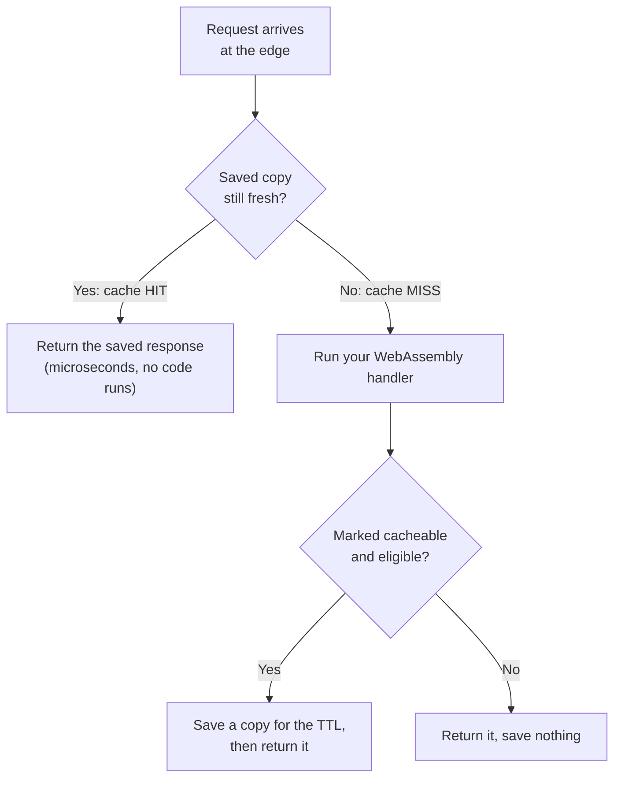
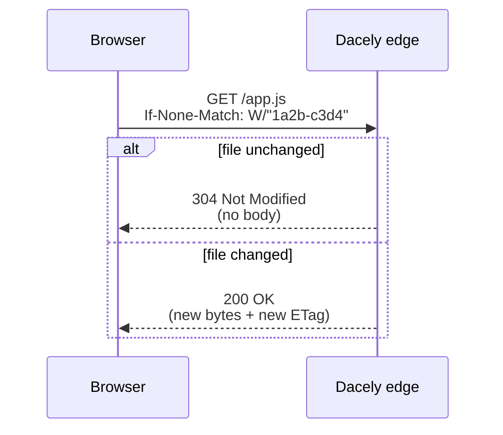

# Caching

**Caching lets the edge keep a copy of a response and hand it back instantly, without re-running your code.** You opt in per route, either with the `@cache` decorator or by calling `Response.cache(...)`.

## What "cache" means here

A **cache** is a fast, temporary store of a previous answer. When a request comes in, the edge can check: "have I already computed this exact response recently?" If yes, that is a **cache hit**: it returns the saved copy in microseconds and never wakes up your WebAssembly program. If no, that is a **cache miss**: it runs your handler, sends the result, and (if you asked it to) saves a copy for next time.

There are two places a response can be cached:

- **The edge cache** is shared: one saved copy on an edge server answers many users. This is where the big speedups come from.
- **The browser cache** is private to one user's browser. You control it with a standard `Cache-Control` header.

You can use one or both.

## When to cache (and when not)

Cache a response only when it is the **same for everyone** and safe to reuse for a little while:

- Good: a public leaderboard, a product catalog, a blog index, an exchange-rate snapshot, a "server status" endpoint.
- Bad: anything personalized (a user's dashboard, their cart, "hello, Alice"). If you cached that, one user could be served another user's data. The edge has strong safety rails against this (below), but the simplest rule is: **do not cache per-user data on the shared edge.**

Caching is **always opt-in**. A response you do not mark is never stored. There is no "cache every GET" mode, because the edge cannot tell a personalized response from a public one on its own.

## How: the `@cache` decorator

A **decorator** is an annotation you put right above a route method. `@cache` tells the edge how long it may reuse the response. The numbers are positional:

```ts
import { Response } from 'toiljs/server/runtime';

@rest('leaderboard')
class Leaderboard {
    @cache(60)                    // 60 MINUTES at the edge
    @get('/')
    public top(): Response {
        // ...expensive query...
        return Response.json(standings);
    }
}
```

The full form is `@cache(edgeTtlMinutes, browserTtlSeconds?, privateScope?, allowAuth?)`:

```ts
@cache(60)                  // 60 minutes at the edge, browser does not cache
@cache(60, 300)             // + tell the browser to cache for 5 minutes (300s)
@cache(60, 300, true)       // + mark it "private": browser only, never the shared edge
@cache(60, 300, true, true) // + allow caching even for logged-in requests (see rails)
```

**TTL** means "time to live": how long a saved copy stays fresh before the edge throws it away and recomputes. Notice the units differ on purpose: the edge TTL is in **minutes**, the browser TTL is in **seconds**.

Every argument must be a plain number or `true`/`false` literal. If you pass something computed (a variable, a function call), the decorator safely degrades to "not cached" instead of misbehaving.

## How: `Response.cache(...)`

`@cache` is just a shorthand. You can do the same thing by hand on any `Response`, which is handy when you decide at runtime:

```ts
public cache(
    edgeTtlMinutes: u16,
    browserTtlSeconds: u32 = 0,
    privateScope: bool = false,
    allowAuth: bool = false,
): Response
```

```ts
return Response.json(body).cache(60, 300);
```

`cache(...)` returns the same `Response`, so it chains. There is also a shorthand for "edge only, no browser caching":

```ts
return Response.bytes(blob).cacheFor(5); // edge-cache 5 minutes
```

Under the hood, both set one header, `Dacely-Cache-Control`, that the edge reads and then strips (it never reaches the client).

## The parameters, in detail

| Parameter | What it does |
| --- | --- |
| `edgeTtlMinutes` | How long the shared edge may serve the saved copy. Clamped to a 24-hour maximum, no matter what you pass. `0` means no edge caching. |
| `browserTtlSeconds` | The `max-age` sent to the browser. `0` (default) means the browser is told not to cache. |
| `privateScope` | Marks the response `private`: it may only live in the browser's own cache, never the shared edge or a CDN. |
| `allowAuth` | Permits caching a response to a logged-in request. Off by default (see safety rails). |

## A hit vs a miss, visually



Every response the edge sends carries a `Dacely-Cache` header so you can see what happened while debugging:

| `Dacely-Cache` value | Meaning |
| --- | --- |
| `HIT` | Served from the cache; your code did not run. |
| `MISS` | Your code ran, and the response was saved (the next identical request should `HIT`). |
| `DYNAMIC` | Your code ran, and the response was not cached (no directive, or not eligible). |
| `BYPASS` | A fallback path (for example the compute layer was momentarily unavailable); not a cached answer. |

## Safety rails (why cross-user leaks cannot happen)

The edge refuses to store certain responses even if you asked it to. These rules exist because a shared cache is exactly where one user's data could accidentally leak to another:

- **5xx responses are never cached.** A server error is temporary; caching a `500` would keep serving the failure for the whole TTL. (2xx, 3xx, and 4xx are cacheable: a redirect or a `404`/`410` is a predictable function of the request.)
- **A response with a `Set-Cookie` is never cached.** A cookie is per-user state.
- **A response to a logged-in request is not cached** unless you pass `allowAuth = true`. This stops one user's personalized response from being handed to someone else. Even with `allowAuth = true`, such an entry is only ever served back to other **authenticated** requests, never to an anonymous one (which would skip the auth check entirely).
- **The edge TTL is clamped to 24 hours.**

The cache is also keyed precisely: an entry is identified by the **host, method, path, and the exact request body**. So a `POST` with body `A` never returns the copy saved for body `B`, and a `GET` never returns a `POST`'s copy.

Because auth checks and body decoding run **before** the cache directive is applied, an unauthorized request is rejected with `401` before anything is stored, and a cached copy only ever comes from a handler that actually ran successfully.

## ETag, Last-Modified, and 304 (static files)

The `@cache` decorator above is for **dynamic** responses (ones your code computes). Your project's **static files** (the built HTML, JS, CSS, and images) get a second, automatic layer of caching that you do not configure. It is worth understanding because it is what makes repeat page loads cheap.

Every static file the edge serves carries three headers:

- **`ETag`**: a short fingerprint of the file's contents (a "version tag"). toiljs uses a *weak* ETag (it starts with `W/`), which survives compression by a CDN in front of the edge.
- **`Last-Modified`**: when the file last changed.
- **`Cache-Control`**: content-hashed assets (files whose name contains their content hash, like `app-CfvHW67Y.js`) get `immutable` with a one-year max-age, because the URL itself changes whenever the content does. Everything else (HTML, non-hashed assets) gets `must-revalidate`, so the browser always checks freshness.

**Revalidation** is the trick. Instead of re-downloading a file it already has, a browser asks "has this changed?" by echoing the tag back in an `If-None-Match` header (or the date in `If-Modified-Since`). If the file is unchanged, the edge replies **`304 Not Modified`** with an empty body, and the browser reuses its copy. A `304` is tiny and fast.



The precedence follows the HTTP spec (RFC 7232): if the request has `If-None-Match`, that decides it; only when it is absent does `If-Modified-Since` apply. You get all of this for free; there is nothing to turn on.

## Where cached bodies live (memory bounds)

You do not need this to use caching, but it explains the limits you may hit.

The edge response cache is bounded and hard-capped so it can never exhaust a node's memory:

- **RAM tier**: small, short-lived responses live in memory, within a bounded budget (on the order of ~128 MB) plus a cap on the number of entries. A single response over ~256 KB does not go in RAM.
- **Disk tier (optional)**: when the operator enables an on-disk spill directory, a **big** response (over ~256 KB) or a **long-lived** one (TTL of 10 minutes or more) is written to disk and served back with near-zero RAM, the same way static files are. If disk spill is not enabled, a big response is simply not cached (you will see `Dacely-Cache: DYNAMIC`).

Expired entries are dropped on read (a stale entry is treated as a miss) and reclaimed when the cache needs room. Nothing survives a process restart.

## Gotchas

- **Units differ.** Edge TTL is in minutes; browser TTL is in seconds. `@cache(60)` is one hour at the edge, not one minute.
- **Do not cache personalized data on the shared edge.** If a response depends on who is asking, either do not cache it, or use `privateScope` so it is browser-only.
- **A `Set-Cookie` disables edge caching for that response.** If you set a cookie, that response will not be edge-cached, by design.
- **Very large or slow-to-change bodies may not be cached** unless disk spill is enabled on the node. Check the `Dacely-Cache` header if a response you expected to cache shows `DYNAMIC`.
- **Nothing persists across restarts.** The cache is a speed optimization, never a source of truth.

## Related

- [Rate limiting](./ratelimit.md): protect a route before it runs.
- [Analytics](./analytics.md): see your cache hit ratio per site.
- [Cookies](./cookies.md): why a `Set-Cookie` opts a response out of edge caching.
- [Auth, sessions, and `@user`](../auth/usage.md): why logged-in responses are not cached by default.
- [Every decorator](../concepts/decorators.md).
