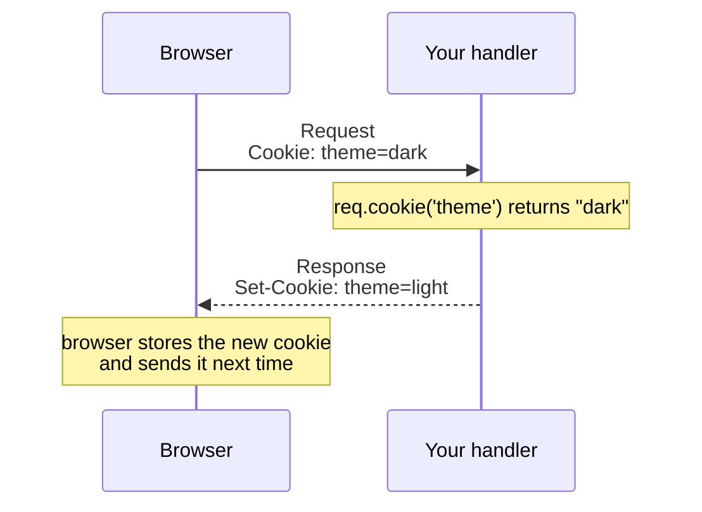

# Cookies

**Cookies let you store a small piece of state in the user's browser and read it back on the next request.** toiljs ships a complete cookie layer: read incoming cookies, set them on a response, and (optionally) sign or encrypt their values so they cannot be tampered with.

## What a cookie is

A **cookie** is a tiny named value the browser holds for your site. The browser sends it back on every request to your site (in a `Cookie` request header), and you can change or add cookies by putting a `Set-Cookie` header on your response. Cookies are how a site remembers things between requests: a theme preference, a feature flag, a session id.

Two directions to keep straight:

- **Reading** happens on the `Request` (the browser sent its cookies to you).
- **Writing** happens on the `Response` (you tell the browser to store or clear a cookie).



The cookie types (`Cookie`, `Cookies`, `CookieMap`, `SecureCookies`, and the `SameSite` / `CookieEncoding` / `CookiePrefix` enums) are **ambient globals**: use them with no import, like `crypto`. They are also exported from `toiljs/server/runtime` if you prefer an explicit import.

## Reading incoming cookies

On the `Request`, two methods cover almost everything:

```ts
const theme = req.cookie('theme');   // one value: string | null
const jar = req.cookies();           // all of them, parsed once and cached
jar.get('theme');                    // "dark", or null
jar.has('theme');                    // true / false
```

`req.cookies()` returns a `CookieMap`, an ordered name-to-value view. It is parsed once per request and cached, so calling it repeatedly is cheap.

## Setting a cookie on a response

Build a cookie with the fluent `Cookie` builder, then attach it with `setCookie`. Every setter returns the cookie, so calls chain:

```ts
import { Response } from 'toiljs/server/runtime';

return Response.json('{"ok":true}').setCookie(
    Cookie.create('theme', 'dark')
        .path('/')
        .maxAge(60 * 60 * 24 * 365)   // one year, in seconds
        .sameSite(SameSite.Lax)
        .secure(),
);
```

Shorthands for the common cases:

```ts
resp.setCookieKV('theme', 'dark');      // name=value, no attributes
resp.clearCookie('theme');              // delete it (empty value, expired)
```

Each `setCookie` adds its own `Set-Cookie` header; cookies are never folded into one header.

### The attributes you will actually use

| Method | Sets | What it means |
| --- | --- | --- |
| `path('/')` | `Path` | Which URL paths the cookie applies to. `/` means the whole site. |
| `maxAge(seconds)` | `Max-Age` | How long the browser keeps it. `0` or negative deletes it now. |
| `secure()` | `Secure` | Only send over HTTPS. Use it for anything that matters. |
| `httpOnly()` | `HttpOnly` | Hide it from JavaScript in the browser (blocks theft via XSS). Use it for session cookies. |
| `sameSite(SameSite.Lax)` | `SameSite` | Controls whether the cookie is sent on cross-site requests. `Lax` is a good default; `Strict` is tighter; `None` allows cross-site (and forces `Secure`). |

You rarely need the rest, but they exist: `domain`, `expires` (an absolute time instead of a duration), `partitioned` (CHIPS), `priority`, and `extension` for anything custom.

## The `__Host-` and `__Secure-` prefixes

Two special name prefixes give the browser extra guarantees. They are not magic strings you invent; browsers recognize them and **refuse** to accept a cookie that carries the prefix without meeting its rules.

- **`__Secure-`**: the cookie must be `Secure` (HTTPS only).
- **`__Host-`**: the cookie must be `Secure`, have `Path=/`, and have **no** `Domain`. This locks the cookie to exactly your host, so a sibling subdomain cannot set or read it. It is the strongest option and the right choice for session cookies.

You do not spell the prefix yourself. Two helpers apply it and enforce the rules for you:

```ts
Cookie.create('sid', 'abc123')
    .httpOnly()
    .sameSite(SameSite.Lax)
    .maxAge(3600)
    .asHostPrefixed();   // prepends __Host-, forces Secure + Path=/ + no Domain
```

`asSecurePrefixed()` is the lighter version (prepends `__Secure-` and forces `Secure`).

> Under `toiljs dev`, browsers treat `http://localhost` as a secure context, so `Secure` and `__Host-` cookies work over plain HTTP locally. You do not need HTTPS to test them.

## Worked example: a theme preference cookie

A tiny handler that reads a `theme` cookie and lets the user flip it. This is the canonical "remember a preference" pattern: a plain, non-secret value.

```ts
import { Response, RouteContext } from 'toiljs/server/runtime';

@rest('prefs')
class Prefs {
    // GET /prefs/theme -> current theme (defaults to "light")
    @get('/theme')
    read(ctx: RouteContext): Response {
        const theme = ctx.request.cookie('theme');
        return Response.text((theme != null ? theme : 'light') + '\n');
    }

    // POST /prefs/theme/dark -> remember "dark" for a year
    @post('/theme/dark')
    setDark(ctx: RouteContext): Response {
        return Response.text('saved\n').setCookie(
            Cookie.create('theme', 'dark')
                .path('/')
                .maxAge(60 * 60 * 24 * 365)
                .sameSite(SameSite.Lax)
                .secure(),
        );
    }
}
```

A preference like this does not need to be secret or tamper-proof (the worst a user can do is change their own theme), so a plain cookie is fine. When the value **does** matter, reach for `SecureCookies`.

## Secure cookies: signing and encryption

Sometimes a cookie value must not be forged or read by the user. `SecureCookies` covers both, built on the `crypto` global (no extra setup):

- **Signed** (`SecureCookies.signed(key)`): the value stays readable but is stamped with a signature (HMAC-SHA256) bound to the cookie's name. The user can see it but cannot change it or move it to another cookie without the signature failing. Use this for a value the client may read but must not tamper with.
- **Encrypted** (`SecureCookies.encrypted(key)`): the value is scrambled (AES-GCM) so the user cannot read **or** change it. Use this for something confidential.

The `key` is raw secret bytes you supply (load it from a secret via [`Environment.getSecure`](./environment.md), never hard-code it):

```ts
// In a real app, load this from a secret, do not inline it.
const key = Uint8Array.wrap(String.UTF8.encode('0123456789abcdef0123456789abcdef'));

// Signed: readable but tamper-proof.
const signer = SecureCookies.signed(key);
const sealed = signer.sign('session', 'user-42');
const user = signer.unsign('session', sealed);   // "user-42", or null if tampered

// Encrypted: unreadable and authenticated.
const box = SecureCookies.encrypted(key);
resp.setCookie(box.seal(Cookie.create('secret', 'top-secret').httpOnly()));
const secret = box.open(req.cookies(), 'secret'); // "top-secret", or null
```

Two important safety properties:

- **Verification never crashes.** `unsign` and `decrypt` return `null` on a tampered, truncated, or wrong-key value; they never throw. That makes them safe to call directly on attacker-controlled input.
- **Values are bound to the cookie name.** A sealed value made for cookie `a` will not verify or decrypt under cookie `b`.

For HMAC keys, use 32 or more bytes. For AES, the key must be exactly 16 or 32 bytes (a wrong length is rejected immediately). You can rotate keys by sealing with a new key while still accepting an old one:

```ts
const signer = SecureCookies.signed(newKey).addKey(oldKey); // seal with new, open with either
```

## Encoding is not encryption

One common mix-up. **Encoding** (the `CookieEncoding` on a `Cookie`, default percent-encoding) only makes a value safe to put on the wire; anyone can reverse it. **Signing / encryption** (`SecureCookies`) is the cryptographic protection and needs a secret key. If you want a value the user cannot forge, you need `SecureCookies`, not a fancier encoding.

## Relationship to auth session cookies

You do not manage login cookies by hand. The [auth system](../auth/usage.md) sets and reads its own hardened, `__Host-` prefixed, signed session cookie for you, and enforces access with the `@auth` decorator. This page is for **your own** cookies (preferences, flags, small bits of state). If you find yourself building a login cookie from scratch, use auth instead; it already does the hard, security-sensitive parts correctly.

## Advanced reference: `Cookie` and `Cookies` helpers

Most handlers only need the builders above. These extra members are here for lower-level work: validating a cookie before you send it, parsing a `Set-Cookie` header back into a `Cookie` (for a proxy or a test), or controlling the exact wire encoding.

### More `Cookie` methods

| Method | Returns | What it does |
| --- | --- | --- |
| `validate()` | `CookieValidation` | Check the cookie against RFC 6265bis (name is a token, name+value within the 4096-byte cap, `Path` form, prefix rules, `SameSite=None` / `Partitioned` imply `Secure`, the 400-day lifetime cap) **without** sending it. Never throws. |
| `serialize(strict)` | `string` | Build the `Set-Cookie` value. Lenient by default (always emits a best-effort cookie); pass `serialize(true)` to **throw** on a hard violation instead. `setCookie(...)` calls this for you. |
| `withEncoding(enc)` | `Cookie` | Choose how the value goes on the wire: `CookieEncoding.Percent` (default), `.Raw`, or `.Base64Url`. Chains like the other setters. |
| `detectedPrefix()` | `CookiePrefix` | Report which special prefix the name carries (`CookiePrefix.Host`, `.Secure`, or `.None`), detected case-insensitively. |
| `encodedValue()` | `string` | The value after the chosen encoding is applied, exactly as it will appear on the wire. |
| `expiresRaw(date)` | `Cookie` | Set `Expires` to a verbatim date string (an escape hatch; it is **not** validated, unlike `expires(epochSeconds)`). |

`validate()` returns a `CookieValidation`, a small result object:

- `valid: bool` is `true` when there were no problems.
- `errors: Array<string>` holds one human-readable message per problem (empty when valid).

```ts
// A __Host- cookie must be Secure with Path=/; here we forgot both.
const c = Cookie.create('__Host-sid', 'abc');
const check = c.validate();
if (!check.valid) {
    // check.errors includes "__Host- prefix requires the Secure attribute"
    // (asHostPrefixed() would have set those attributes for you)
}
```

### `Cookies` static helpers

`Cookies` is the read side, plus a couple of codec shortcuts. Every method is static, so call them as `Cookies.xxx(...)`.

| Call | Returns | What it does |
| --- | --- | --- |
| `Cookies.parse(header)` | `CookieMap` | Parse a request `Cookie` header (`a=1; b=2`) into a name-to-value map. Values are percent-decoded; malformed pairs are skipped, never thrown. |
| `Cookies.get(header, name)` | `string \| null` | Shorthand: parse `header` and return one value (or `null`). |
| `Cookies.serialize(name, value)` | `string` | One-shot `Set-Cookie` value for `name=value` with no attributes. For attributes, build a `Cookie` and call `serialize()`. |
| `Cookies.parseSetCookie(header)` | `Cookie` | Parse a `Set-Cookie` field value back into a `Cookie` (handy for proxies or tests). The value is kept verbatim (`CookieEncoding.Raw`) so re-serializing reproduces the original. |
| `Cookies.encodeValue(raw)` | `string` | Percent-encode a value the way the default `Cookie` encoding would. |
| `Cookies.decodeValue(enc)` | `string` | Percent-decode a value (the inverse of `encodeValue`). |

```ts
// Round-trip a Set-Cookie header (for example, inspecting an upstream response in a proxy):
const cookie = Cookies.parseSetCookie('sid=abc123; Path=/; HttpOnly; SameSite=Lax');
cookie.name;          // "sid"
cookie.serialize();   // "sid=abc123; Path=/; SameSite=Lax; HttpOnly"
```

## Gotchas

- **Read on the `Request`, write on the `Response`.** Setting a cookie does not change what `req.cookie(...)` returns for the current request; it takes effect on the browser's next request.
- **`maxAge` is in seconds.** `maxAge(3600)` is one hour, not one millisecond.
- **To delete a cookie, the `path` (and `domain`) must match** the ones you set it with. Use `clearCookie(name, path, domain)`.
- **A `Set-Cookie` opts a response out of edge caching.** By design, a response that sets a cookie is never edge-cached, because a cookie is per-user state. See [Caching](./caching.md).
- **Do not put secrets in a plain cookie value.** Use `SecureCookies.encrypted(...)`, and load the key from a [secret](./environment.md).

## Related

- [Auth, sessions, and `@user`](../auth/usage.md): the built-in, hardened session cookie.
- [Crypto](./crypto.md): the primitives under `SecureCookies`.
- [Environment and secrets](./environment.md): where to store your signing / encryption key.
- [Caching](./caching.md): why setting a cookie disables edge caching.
