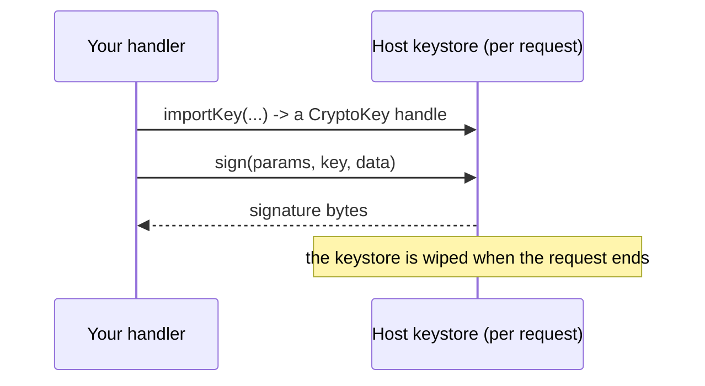

# Crypto

A small, safe cryptography toolkit (hashing, random bytes, HMAC, symmetric encryption, key derivation, and signatures) available with no import through the ambient `crypto` global.

Reach for `crypto` to fingerprint a value (hashing), generate an unguessable token or ID (random bytes), prove a value has not been tampered with (HMAC or a signature), or encrypt data you store yourself (AES). Skip it for **login passwords**: use [auth](../auth/README.md), which is purpose-built and does the hard parts for you. `crypto` is also the engine under [signed cookies](./cookies.md) and auth, so most apps use it indirectly without ever calling it.

## The shape of the API

`crypto` mirrors the browser Web Crypto API, with one big difference: **there are no Promises**. ToilScript (the language your backend is written in) has no `async`, so every call returns its result **directly**, right away.

```ts
const digest = crypto.sha256Text('hello'); // Uint8Array, no await
const id     = crypto.randomUUID();         // string, no await
```

There are two layers:

- **`crypto.*`**: ergonomic one-call helpers (hash this string, give me a UUID, HMAC these bytes). Start here.
- **`crypto.subtle`**: the full primitive surface (import a key, encrypt, sign, derive bits) for when you need more control.

Both are ambient globals (no import). The small helper classes and the `ALG_*` / `FMT_*` / `USAGE_*` / `CURVE_*` constants you pass to `subtle` are imported from the `'crypto'` module.

## Quick helpers (`crypto.*`)

Every helper is synchronous and returns its value directly.

| Helper | Signature | What it does |
| --- | --- | --- |
| `getRandomValues` | `(array: Uint8Array): void` | Fill the array with cryptographically strong random bytes. |
| `randomUUID` | `(): string` | A random RFC 4122 v4 UUID string. |
| `sha1` / `sha256` / `sha384` / `sha512` | `(data: Uint8Array): Uint8Array` | Hash raw bytes. |
| `sha1Text` … `sha512Text` | `(s: string): Uint8Array` | UTF-8 encode the string, then hash. |
| `hmacSha256` | `(key: Uint8Array, msg: Uint8Array): Uint8Array` | Keyed fingerprint (HMAC-SHA-256) of bytes. |
| `hmacSha256Text` | `(key: Uint8Array, msg: string): Uint8Array` | HMAC-SHA-256 over a string. |
| `toHex` | `(bytes: Uint8Array): string` | Lowercase hex string (for display or storage). |
| `subtle` | `SubtleCrypto` | The full primitive surface (below). |

**Hashing** turns any input into a fixed-size fingerprint. The same input always gives the same output, and you cannot work backward from the fingerprint to the input. Use it to compare or index a value without storing the original (for example, keying a cache by the hash of a URL).

**Random bytes** come from a CSPRNG (a cryptographically secure random generator), which means the output is unpredictable and safe for tokens, session IDs, and IVs. Never use `Math.random()` for anything security-related.

**HMAC** is a fingerprint computed *with a secret key*. Anyone can hash a value, but only someone who holds the key can produce the correct HMAC, so it proves a value came from you and was not altered. This is exactly what [`TwoFactor`](./email.md) tokens and [signed cookies](./cookies.md) use.

## Worked example: hash a value and generate a token

```ts
import { RouteContext } from 'toiljs/server/runtime';

@rest('demo')
class Demo {
    @get('/')
    public example(ctx: RouteContext): string {
        // Hash a value to a hex fingerprint (safe to log or use as a key).
        const digest = crypto.sha256Text('alice@example.com');
        const fingerprint = crypto.toHex(digest); // 64 hex chars

        // Generate a 128-bit unguessable token as hex.
        const bytes = new Uint8Array(16);
        crypto.getRandomValues(bytes);
        const token = crypto.toHex(bytes); // 32 hex chars

        // A ready-made unique id.
        const id = crypto.randomUUID();

        return `fp=${fingerprint} token=${token} id=${id}`;
    }
}
```

To fingerprint a value *with a secret* (so only your server can produce or check it), use HMAC:

```ts
const key = Uint8Array.wrap(String.UTF8.encode(Environment.getSecure('SIGNING_KEY')!));
const mac = crypto.hmacSha256Text(key, 'order:42');
const macHex = crypto.toHex(mac);
```

## The primitive surface (`crypto.subtle`)

Use `subtle` when the helpers are not enough: symmetric encryption, signatures, or key derivation. Every method is synchronous.

| Method | Signature |
| --- | --- |
| `digest` | `digest(algorithm: i32, data: Uint8Array): Uint8Array` |
| `importKey` | `importKey(format: i32, keyData: Uint8Array, algorithm: AlgorithmParams, extractable: bool, usages: i32): CryptoKey` |
| `exportKey` | `exportKey(format: i32, key: CryptoKey): Uint8Array` |
| `encrypt` | `encrypt(algorithm: AlgorithmParams, key: CryptoKey, data: Uint8Array): Uint8Array` |
| `decrypt` | `decrypt(algorithm: AlgorithmParams, key: CryptoKey, data: Uint8Array): Uint8Array` |
| `sign` | `sign(algorithm: AlgorithmParams, key: CryptoKey, data: Uint8Array): Uint8Array` |
| `verify` | `verify(algorithm: AlgorithmParams, key: CryptoKey, signature: Uint8Array, data: Uint8Array): bool` |
| `deriveBits` | `deriveBits(algorithm: AlgorithmParams, baseKey: CryptoKey, length: i32): Uint8Array` |
| `deriveKey` | `deriveKey(algorithm, baseKey, lengthBits, derivedKeyAlgorithm, extractable, usages): CryptoKey` |

Two things differ from the browser API, both because of the missing-Promise design:

- **`algorithm` and `format` are integer constants, not strings.** You pass `ALG_SHA_256` (not `"SHA-256"`) and `FMT_RAW` (not `"raw"`). The constants are listed below.
- **`verify` returns a `bool`.** A signature mismatch returns `false` (it does not throw). A real error, like an invalid key, does throw.

### Keys are per-request handles

You never hold raw key bytes in your code for long. `importKey` gives you back a **`CryptoKey`**, which is an opaque handle into a host-side keystore. That keystore is **wiped when the request ends**, so a `CryptoKey` is valid only within the request that created it. Never cache one across requests; import it again each time.



### Algorithm parameter classes

Each algorithm takes a small parameters object you build and pass in. Import the class you need from `'crypto'`:

```ts
import { AesGcmParams, HmacImportParams, ALG_SHA_256, USAGE_ENCRYPT, USAGE_DECRYPT } from 'crypto';
```

| Class | Constructor | Used for |
| --- | --- | --- |
| `AesGcmParams` | `(iv, additionalData?, tagLength = 128)` | AES-GCM encrypt/decrypt |
| `AesCbcParams` | `(iv)` | AES-CBC |
| `AesCtrParams` | `(counter, length = 128)` | AES-CTR |
| `HmacImportParams` | `(hash)` | importing an HMAC key |
| `HmacParams` | `()` | HMAC sign/verify (hash comes from the key) |
| `Pbkdf2Params` | `(hash, salt, iterations)` | deriving a key from a password |
| `HkdfParams` | `(hash, salt, info?)` | deriving a key from key material |
| `EcdsaParams` | `(hash)` | ECDSA sign/verify |
| `EcKeyImportParams` | `(alg, namedCurve)` | importing an EC key |
| `Ed25519Params` | `()` | Ed25519 sign/verify |
| `X25519ImportParams` | `()` | importing an X25519 key |
| `EcdhParams` | `(alg, publicKeyHandle)` | ECDH / X25519 key agreement |

### Constants

- **Hashes and algorithms:** `ALG_SHA_1`, `ALG_SHA_256`, `ALG_SHA_384`, `ALG_SHA_512`, `ALG_SHA3_256`, `ALG_SHA3_384`, `ALG_SHA3_512`, `ALG_AES_GCM`, `ALG_AES_CBC`, `ALG_AES_CTR`, `ALG_AES_KW`, `ALG_HMAC`, `ALG_ECDSA`, `ALG_ED25519`, `ALG_ECDH`, `ALG_X25519`, `ALG_HKDF`, `ALG_PBKDF2`.
- **Key formats:** `FMT_RAW`, `FMT_PKCS8`, `FMT_SPKI`. (`FMT_JWK` is rejected.)
- **Key usages (a bitmask, OR them together):** `USAGE_ENCRYPT`, `USAGE_DECRYPT`, `USAGE_SIGN`, `USAGE_VERIFY`, `USAGE_DERIVE_KEY`, `USAGE_DERIVE_BITS`, `USAGE_WRAP_KEY`, `USAGE_UNWRAP_KEY`.
- **Named curves:** `CURVE_P256`, `CURVE_P384`. (`CURVE_P521` is not supported.)

The `digest` selector also accepts the SHA3 constants, so `crypto.subtle.digest(ALG_SHA3_256, data)` works even though there is no `sha3` quick helper.

### `CryptoKey`

A `CryptoKey` is a handle plus metadata: `handle: i32`, `type: string` (`"secret"`, `"public"`, or `"private"`), `extractable: bool`, `algorithm: i32`, and `usages: i32`, with `algorithmName()` and `hasUsage(u)` helpers. Remember it is only valid within the current request.

## Example: AES-256-GCM encrypt and decrypt

AES-GCM is authenticated encryption: it both hides the data and detects tampering. It needs a 32-byte key and a fresh 12-byte IV (a "number used once"). **Never reuse an IV with the same key**; generate a new one every time.

```ts
import { AesGcmParams, ALG_AES_GCM, FMT_RAW, USAGE_ENCRYPT, USAGE_DECRYPT } from 'crypto';

// 32-byte key and a fresh 12-byte IV.
const rawKey = new Uint8Array(32); crypto.getRandomValues(rawKey);
const iv     = new Uint8Array(12); crypto.getRandomValues(iv);

// Import the key once; grant it both usages so it can round-trip.
const key = crypto.subtle.importKey(
    FMT_RAW, rawKey, new AesGcmParams(iv), false, USAGE_ENCRYPT | USAGE_DECRYPT,
);

const plaintext  = Uint8Array.wrap(String.UTF8.encode('secret note'));
const ciphertext = crypto.subtle.encrypt(new AesGcmParams(iv), key, plaintext);
const recovered  = crypto.subtle.decrypt(new AesGcmParams(iv), key, ciphertext);
// recovered == plaintext
```

Store the `iv` next to the ciphertext (it is not secret); you need the same IV to decrypt.

## Example: HMAC with `subtle`

The quick `crypto.hmacSha256` helper does this in one line, but here is the explicit form, which mirrors how [`TwoFactor`](./email.md) signs its tokens:

```ts
import { HmacImportParams, HmacParams, ALG_SHA_256, FMT_RAW, USAGE_SIGN, USAGE_VERIFY } from 'crypto';

const key = crypto.subtle.importKey(
    FMT_RAW, rawKeyBytes, new HmacImportParams(ALG_SHA_256), false, USAGE_SIGN | USAGE_VERIFY,
);

const mac = crypto.subtle.sign(new HmacParams(), key, message);
const ok: bool = crypto.subtle.verify(new HmacParams(), key, mac, message); // true

// verify compares in constant time and returns false on a mismatch (it does not throw).
```

## Limitations

- **No Promises.** Every call is synchronous.
- **No RSA.** It was dropped because the only pure-Rust implementation had an unfixable timing weakness. Use ECDSA or Ed25519 for signatures.
- **No JWK key format.** Use `FMT_RAW`, `FMT_PKCS8`, or `FMT_SPKI`.
- **No on-host key generation.** Keys are always **imported**, never generated on the server. Generate them elsewhere and import the bytes.
- **No P-521.** `CURVE_P256` and `CURVE_P384` are supported.
- **Keys do not survive the request.** A `CryptoKey` is a per-request handle; re-import each request.
- **Every call is metered.** Crypto operations cost compute gas (charged up front from the sizes involved), so an over-budget call fails cleanly instead of burning CPU.

### Post-quantum signature verify

Auth's login uses a post-quantum signature scheme (ML-DSA) that the host can **verify** (it never holds a private key). This underpins the [auth login stack](../auth/how-it-works.md); you reach it through `AuthService`, not through `crypto` directly, so it is documented there rather than here.

## Related

- [Auth: how it works](../auth/how-it-works.md), the post-quantum login stack built on host-side verify.
- [Cookies](./cookies.md), signed and encrypted cookies built on `crypto`.
- [Email](./email.md), whose `TwoFactor` codes are HMAC tokens.
- [Environment and secrets](./environment.md), where you keep signing and encryption keys.
