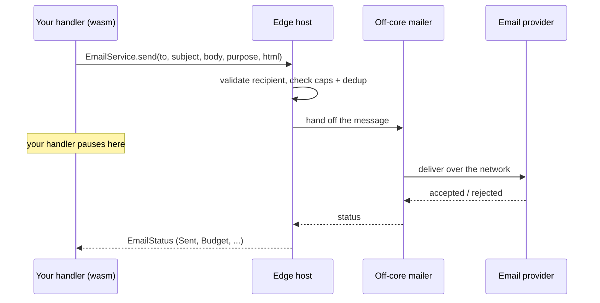

# Email

Send transactional email (verification codes, password resets, receipts) straight from a route handler.

Reach for email when your app needs to message one user because of something they did: confirm a signup, send a 2FA code, mail a receipt. It is built for **transactional** email (one message, triggered by an action), not bulk marketing or newsletters. There is no attachment support and no per-recipient dynamic content beyond simple placeholders (see [gotchas](#gotchas-and-limits)).

Everything here is an **ambient global**: an object you can use without importing it, exactly like [`crypto`](./crypto.md) or `Environment`. A backend that never sends email pulls none of this into its compiled program.

- **`EmailService`** sends one email.
- **`EmailTemplate`** is a reusable message with `{{placeholder}}` holes (plain text and/or HTML).
- **`emails/*.tsx`** lets you author emails as React components; the build turns each into a typed `Emails.<Name>.send(...)`.
- **`TwoFactor`** issues and checks email verification codes with no database.

## How a send works

When your handler calls `EmailService.send(...)`, it does not talk to the email provider itself. The **edge** (the Dacely server running your code) validates the recipient, checks your sending limits, then hands the message to a single background "mailer" thread that talks to the provider. Your handler **suspends** (pauses) until the mailer reports a result, so a slow provider never freezes the worker that is serving other requests.



## Send one email

`EmailService.send` takes the recipient, a subject, a plain-text body, a short `purpose` tag, and an optional HTML body. It returns an `EmailStatus` telling you what happened.

```ts
import { Response, RouteContext } from 'toiljs/server/runtime';

@rest('notify')
class Notify {
    @post('/welcome')
    welcome(ctx: RouteContext): Response {
        const status = EmailService.send(
            'alice@example.com',           // to: exactly one address
            'Welcome!',                    // subject
            'Thanks for signing up.',      // plain-text body
            'welcome',                     // purpose tag (used for dedup + abuse limits)
            '<h1>Thanks for signing up.</h1>', // optional HTML body
        );

        return status == EmailStatus.Sent
            ? Response.text('sent\n')
            : Response.text('could not send\n', 503);
    }
}
```

The full signature is `send(to, subject, body, purpose = 'tx', html = '')`. Pass a non-empty `html` to send an HTML message; then `body` is the plain-text fallback (set both for the best deliverability, or leave `body` empty for HTML-only).

`EmailStatus` is a global enum, so you can compare against it (`status == EmailStatus.Sent`) with no import. `Sent` and `Deduped` mean success; the rest tell you why the message was not delivered and whether retrying could help.

| Status | Meaning | Retry? |
| --- | --- | --- |
| `Sent` | Accepted by the provider. | done |
| `Deduped` | An identical recent `(recipient, purpose)` send was collapsed into one. | treat as sent |
| `Budget` | Your per-minute (or per-day) send budget is exhausted. | yes, later |
| `TryLater` | The mailer was momentarily saturated. | yes, back off |
| `RecipientCapped` | This recipient hit their hourly cap. | no (this window) |
| `BadRecipient` | The address failed validation (multiple addresses, control characters). | no |
| `Disabled` | This site has no email configured. | no |
| `ProviderError` | The provider rejected it, or delivery failed after retries. | no |

The `purpose` is a short, non-sensitive tag like `"welcome"` or `"reset"`. The edge folds it into two things: a **dedup key** (an identical `(site, recipient, purpose)` within about 30 seconds becomes one send, which returns `Deduped`) and the **abuse counters**. It is never logged in the clear, so keep real user data out of it.

The recipient is checked on the host: exactly one address, no carriage returns, line feeds, or angle brackets. That means a bad or hostile input can never smuggle a second recipient or inject an email header.

## Configure email

Email is **off by default**. A site that has not configured it gets `Disabled` from every send. You configure it in two places: non-secret settings in `toil.config.ts`, and the provider credential as a **secret** in the [environment store](./environment.md) (never in your code or your compiled program).

```ts
// toil.config.ts
import { defineConfig } from 'toiljs/compiler';

export default defineConfig({
    server: {
        email: {
            provider: 'resend',       // 'resend' | 'gmail' | 'smtp'
            from: 'you@example.com',  // the From address (validated; single address)
            maxPerMin: 60,            // per-site cap: at most 60 sends per rolling minute
        },
    },
});
```

The credential lives in your secrets file as a reserved `TOIL_EMAIL_*` key. These keys are **host-only**: the edge reads them in Rust, and they are stripped out of the buckets your code can read, so a tenant can never fish the API key out with `Environment.getSecure`.

```bash
# .env.secrets   (gitignored; never committed, never in the .wasm)
TOIL_EMAIL_API_KEY=re_xxxxxxxxxxxx
```

On the production edge the same keys live in the site's secrets file (mode `0600`, kept out of the config directory the file watcher sees), so a credential is never written to a log, to `/_admin`, or into your deployed module. See [Environment and secrets](./environment.md) for how the store works.

### Providers

You pick one provider. Each maps `TOIL_EMAIL_API_KEY` to the right credential.

| Provider | `provider` | What `TOIL_EMAIL_API_KEY` holds | Extra keys |
| --- | --- | --- | --- |
| **Resend** | `resend` | A Resend API key (a JSON API). | none |
| **Gmail** | `gmail` | A Gmail **App Password** (SMTP over `smtp.gmail.com:587`). | none |
| **Generic SMTP** | `smtp` | The SMTP password. | `TOIL_EMAIL_SMTP_HOST` (required), optional `TOIL_EMAIL_SMTP_PORT` (defaults `587`), `TOIL_EMAIL_SMTP_USER` (defaults to `from`) |

For Gmail you need 2-Step Verification on the account, then create an App Password at `https://myaccount.google.com/apppasswords`. The username is your `from` address. For generic SMTP, port `587` uses STARTTLS and port `465` uses implicit TLS.

Every setting can also be given as a `TOIL_EMAIL_*` environment variable, and those override the `toil.config.ts` values. That means the exact same secrets file works in local dev and on the edge.

### Local dev behavior

`toiljs dev` runs the **full email pipeline** in Node: recipient validation, dedup, and every cap behave exactly like the edge. Once you set a provider plus `TOIL_EMAIL_API_KEY`, dev **really sends** (Resend over its API, Gmail/SMTP over nodemailer). If you have **not** configured a provider, `EmailService.send` becomes a log-only mock that returns `Sent`, so a signup flow that emails a code still works end to end without any setup.

> One dev-only nuance: the dev server runs your code synchronously, so the actual network send is fire-and-forget. Validation and the caps return their exact status immediately, but a `Sent` is optimistic; the real delivery outcome (or a `ProviderError`) is logged, not returned. The programming interface is identical to the edge, so code that runs in dev runs unchanged in production.

## Templates with `{{placeholders}}`

When you send the same shape of email with different values, define an `EmailTemplate` once. `{{name}}` holes are filled from a `Map` at send time.

```ts
const welcome = new EmailTemplate(
    'Welcome, {{name}}!',                                  // subject
    'Hi {{name}}, your code is {{code}}.',                 // plain-text body
    '<h1>Welcome, {{name}}</h1><p>Code: <b>{{code}}</b></p>', // html (optional)
);

const vars = new Map<string, string>();
vars.set('name', 'Alice');
vars.set('code', '123456');

const status = welcome.send('alice@example.com', vars, 'welcome');
```

- `{{ name }}` with surrounding spaces is accepted; an unknown placeholder renders to an empty string.
- Omit the third argument for a plain-text-only template.
- `template.render(vars)` returns the rendered `{ subject, body, html }` **without** sending, which is handy for previews and tests.

For anything richer than token substitution (real layout, brand styling), author the email as a React component instead.

## React email templates

You can write emails as React components in an **`emails/`** folder. At `toiljs build` each one is rendered **once, at build time**, into a static string of HTML with inline styles, and its props become `{{token}}` holes. The build then generates a typed `Emails.<Name>.send(...)` for your server to call.

Why build-time? Email clients (Gmail, Outlook, Apple Mail) run **no JavaScript** and strip `<style>` blocks and external CSS. So an HTML email has to be a finished, inline-styled string. Rendering it once at build gives you React ergonomics while shipping the inbox exactly what it can display.

```tsx
// emails/Welcome.tsx
export const subject = 'Welcome, {{name}}!';

export default function Welcome({ name, code }: { name: string; code: string }) {
    return (
        <table
            width="100%"
            style={{ fontFamily: 'Arial, sans-serif' }}>
            <tbody>
                <tr>
                    <td style={{ padding: '24px' }}>
                        <h1 style={{ color: '#111' }}>Welcome, {name}!</h1>
                        <p>
                            Your code is <b>{code}</b>.
                        </p>
                    </td>
                </tr>
            </tbody>
        </table>
    );
}
```

The generated `Emails.Welcome.send(...)` takes the recipient, then one argument per `{{token}}` **in alphabetical order**, then an optional `purpose`:

```ts
// Welcome.tsx uses {{code}} and {{name}}  ->  params are (code, name), alphabetical
const status = Emails.Welcome.send('alice@example.com', '123456', 'Alice');
```

Authoring notes:

- **Styles must end up inline.** Write inline `style={{ ... }}`, or import a stylesheet and its rules are inlined into each element for you at build. A bare CSS import on its own has no effect on the rendered email.
- **Optional exports:** `subject` (a token template; defaults to the file name), `text` (a plain-text alternative; otherwise derived from the HTML), and `purpose`.
- **Field substitution only.** Because the component renders once at build time, a runtime `{items.map(...)}` bakes in at build; it does not re-run per recipient. That is perfect for verification, confirmation, and receipt emails; a truly dynamic list needs a different approach.

While `toiljs dev` runs, open **`/__toil/emails`** (the dev banner prints the link) to preview every `emails/*.tsx`, fill each `{{token}}`, and toggle the HTML and plain-text parts. It refreshes as you edit.

## Verification codes with `TwoFactor`

`TwoFactor` issues and checks short numeric codes (for 2FA, email confirmation, or magic-code login) with **no database**. That is possible because it is **stateless**: instead of storing the code server-side, it emails the code and returns a signed **token** that commits to the code using [HMAC](./crypto.md) (a keyed fingerprint). The code itself is only ever in the email; the token holds a fingerprint of it, not the code.

To verify, the server recomputes the fingerprint from the token plus the code the user typed and compares them in constant time. A valid `(token, code)` pair can only come from someone who **both** received the email and holds the token, and the fingerprint binds the recipient, the purpose, and an expiry so a token cannot be replayed for another address, another flow, or after it expires.

```ts
// 1. Issue and email a code. Hand the returned token to the client
//    (a cookie or a hidden form field).
const challenge = TwoFactor.send('alice@example.com', 'login');
// challenge.token  -> give this to the client
// challenge.status -> the EmailStatus of the send (check it was Sent/Deduped)

// 2. Later, when the user submits the code they received:
const ok: bool = TwoFactor.verify(challenge.token, 'alice@example.com', userEntered);
if (ok) {
    // the code is valid and unexpired
}
```

The three entry points:

- **`send(recipient, purpose, ttlSecs = 600, digits = 6)`** issues a code, emails it with a built-in template, and returns `{ token, status }`.
- **`issue(recipient, purpose, ttlSecs, digits)`** returns `{ code, token }` **without** sending, so you can email `code` yourself with a branded `EmailTemplate` or `Emails.*` message.
- **`verify(token, recipient, code)`** returns `true` only for a code issued for that recipient that has not expired.

One-time setup: call **`TwoFactor.setSecret(secret)`** once at startup in `main.ts`. This is the HMAC key that signs the tokens. It must be identical on every edge instance and must never end up in a client bundle. (It is separate from your email provider key.)

> **Important limitation: not single-use.** `TwoFactor` gives you integrity and expiry, but because it stores no state, a valid code verifies **repeatedly** until its TTL runs out. Keep the TTL short. If you need true single-use, record a per-recipient "last verified at" (in your database or the edge store) and reject any code at or before it.

## Worked example: welcome email plus a 2FA code

A signup route that emails a welcome message and starts a 2FA challenge in one handler:

```ts
import { Response, RouteContext } from 'toiljs/server/runtime';

@rest('signup')
class Signup {
    @post('/start')
    start(ctx: RouteContext): Response {
        const email = ctx.query('email'); // in real code, validate this first

        // 1. Friendly welcome (fire it, but note the status for logging).
        Emails.Welcome.send(email, '123456', 'Alice');

        // 2. Start a 2FA challenge; the code is emailed, the token comes back.
        const challenge = TwoFactor.send(email, 'signup');
        if (challenge.status != EmailStatus.Sent && challenge.status != EmailStatus.Deduped) {
            return Response.text('could not send code\n', 503);
        }

        // Hand the token to the client (here, a JSON field; a cookie also works).
        return Response.json(`{"token":${JSON.stringify(challenge.token)}}`);
    }

    @post('/confirm')
    confirm(ctx: RouteContext): Response {
        const email = ctx.query('email');
        const token = ctx.query('token');
        const code = ctx.query('code');

        const ok: bool = TwoFactor.verify(token, email, code);
        return ok ? Response.text('confirmed\n') : Response.text('bad code\n', 400);
    }
}
```

To make `TwoFactor` verify across restarts and across the fleet, set the secret once at startup:

```ts
// main.ts
TwoFactor.setSecret(crypto.sha256Text(Environment.getSecure('TWOFA_SECRET')!));
```

For where email and codes fit into a full login flow, see [extending auth](../auth/extending.md).

## Gotchas and limits

- **Email is opt-in.** No config means every send returns `Disabled`. Check the status.
- **The provider key is host-only.** It never appears in your compiled module, in logs, or in `/_admin`. You cannot read it with `Environment.getSecure`; that is by design.
- **No attachments, no dynamic per-recipient lists.** The API sends a subject plus a text and/or HTML body. React templates substitute fields; they do not re-render per recipient.
- **`TwoFactor` is not single-use.** See the limitation above. Keep TTLs short.
- **Caps are enforced on the host, exactly.** A per-site per-minute cap (`maxPerMin`) and an optional per-day cap, plus a per-recipient hourly cap and about 30 seconds of dedup. Over a cap you get `Budget`, `RecipientCapped`, or `Deduped`, never a silent drop. Editing the caps takes effect on the next send with no restart.
- **Put nothing sensitive in `purpose`.** It keys dedup and abuse counters; use a short tag like `"reset"`.
- **Observability:** `GET /_admin/email` returns counts by reason (submitted, sent, deduped, budget, and so on). It exposes counts only, never a recipient, subject, body, or code.

## Related

- [Environment and secrets](./environment.md), where `TOIL_EMAIL_API_KEY` lives.
- [Crypto](./crypto.md), the HMAC and random primitives `TwoFactor` is built on.
- [Rate limiting](./ratelimit.md), to protect any route that triggers an email (like "send me a code").
- [Extending auth](../auth/extending.md), for email and codes inside a login flow.
- [HTTP routes](../backend/rest.md), for `@rest` / `@post` and `RouteContext`.
