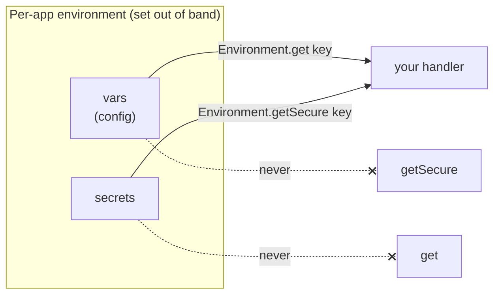

# Environment and secrets

**`Environment` gives your app configuration values and secrets that are set outside your code**, so your compiled backend (`.wasm`) never carries a password or an API key. You read them at runtime; you never write them from code.

## Why this exists

Your backend often needs two kinds of outside values:

- **Config**: non-sensitive settings that can change per deployment, like a public API base URL, a region name, or a feature flag.
- **Secrets**: sensitive values you must never leak, like a payment provider's API key.

The wrong way to handle these is to type them into your source code. Then your secret is in your git history, in your build output, and in the `.wasm` shipped to every edge node. The right way, and the way toiljs uses, is the **GitHub Actions model**: you set these values out of band (today a dashboard, backed by the edge database), and your code reads them by name at runtime. Your compiled program carries **no credentials**.

`Environment` is an ambient global: you use it with no import, like `Time` or `crypto`.

## The two buckets: `get` vs `getSecure`

There are two **disjoint** buckets, exactly like GitHub Actions' `vars` versus `secrets`:

- **`Environment.get(key)`** reads a **plain variable** (config). Returns the string, or `null` if it is not set.
- **`Environment.getSecure(key)`** reads a **secret**. Returns the string, or `null` if it is not set.

"Disjoint" means the buckets never overlap: a secret is **never** returned by `get()`, and a plain var is never returned by `getSecure()`. This is a deliberate safety property. It means a secret cannot leak through a code path that logs the result of a `get()`, because `get()` can never see a secret in the first place. Keys are case-sensitive and matched exactly.



## How: a worked example reading a secret

Here a route reads a public config value and a secret, then uses the secret to authorize a call to a third party. Note what it does **not** do: it never logs the secret and never returns it to the client.

```ts
import { Response, RouteContext } from 'toiljs/server/runtime';

@rest('billing')
class Billing {
    @get('/status')
    show(ctx: RouteContext): Response {
        const base = Environment.get('PUBLIC_API_BASE');   // plain var, or null
        const key = Environment.getSecure('STRIPE_KEY');   // secret, or null

        if (key == null) {
            return Response.text('billing not configured\n', 503);
        }

        // Use `key` to authorize an outbound call. NEVER log it,
        // NEVER put it in the response, NEVER copy it into the client bundle.
        // (Outbound calls are made from a daemon or service; see the links below.)

        return Response.text(base != null ? base : 'unset');
    }
}
```

Both getters return `string | null`. Always handle the `null` case: a value that is not configured comes back as `null`, not an empty string or a crash.

> **Secrets are plaintext in your module at runtime.** That is the point: you need the actual bytes to call out to a third party. So the rule is simple. Do not log a secret, do not put it in a response, and do not copy it into anything the browser receives.

## Where the values live

You set vars and secrets in **two separate places**, so the split is structural (the secrets store can be locked down on its own).

### On the edge

Each host has its own environment, backed by the edge database and, as a fallback, by two dotenv files kept **outside** your deployed project (so the config watcher never even sees a credential):

```bash
# $TOIL_ENV_DIR/<host>.env          (default dir: /run/toil/env)  -> Environment.get(...)
PUBLIC_API_BASE=https://api.example.com
REGION=eu

# $TOIL_ENV_DIR/<host>.env.secrets  (mode 0600)                   -> Environment.getSecure(...)
STRIPE_KEY=sk_live_xxx
```

A **dotenv file** is just `KEY=value`, one per line, with `#` comments, optional `export`, and optional quotes.

Framework-reserved keys use the `TOIL_` prefix (today, the `TOIL_EMAIL_*` email provider config). These are **host-only**: resolved and used in Rust where the framework needs them, and **stripped from both guest buckets**, so your code can never read them with `get` or `getSecure`. You do not read email config yourself; see [Email](./email.md).

### In local development

`toiljs dev` reads two files at your project root:

```bash
# .env          (plain vars)
PUBLIC_API_BASE=http://localhost:4000

# .env.secrets  (secrets; mode 0600; gitignored by the scaffold)
STRIPE_KEY=sk_test_xxx
```

It also overlays `process.env` as plain vars, for convenience. The behavior is identical to the edge, so code that reads env in dev reads it the same way in production. Both files are gitignored by the project scaffold so you do not commit them by accident.

## Secrets never enter the `.wasm`

This is the whole point, so it is worth stating plainly. Your source code contains only the **names** you look up (`'STRIPE_KEY'`), never the values. The compiler turns your names into calls to a host function; the actual value is resolved on the trusted server side, from that host's environment, at the moment you ask. The value is never baked into the compiled module and never shipped to the browser.

On the edge, a secret is **zeroized** (wiped from memory) when the host goes cold, so it does not linger.

## How caching works (and why it is safe)

Reading env goes through a host lookup, so the edge caches values so a busy app is not paying for a fresh lookup on every request. The cache is designed to be abuse-proof:

- **Lazy**: env is loaded the first time your code reads it, not eagerly. A host that never reads env costs nothing.
- **Shared and read-only**: the data lives in one place and is never copied per request.
- **Bounded with idle eviction (a TTL cache)**: entries are dropped after they sit unused, and the total size is capped. So a flood of requests to many different hosts can never grow memory without bound, and secrets are wiped when a host goes cold.

You do not manage any of this. You just call `get` / `getSecure`.

## Build-time config vs runtime environment

Do not confuse two different things that both feel like "configuration":

- **Build-time config** lives in your project's config file (for example `toil.config.ts`). It shapes how your app is *built and wired*: routes, tiers, which features are on. It is baked into the build. See [Configuration](../concepts/config.md).
- **Runtime environment** (this page) is resolved *while your code runs*, per host, and is never baked in. It is where secrets and per-deployment values belong.

Rule of thumb: if a value is a secret, or it differs between your dev machine and production, it belongs in the runtime environment, not in build-time config.

## Gotchas

- **`Environment` is read-only.** There is no `set`. You configure values out of band (dashboard / dotenv files), never from the module.
- **Handle `null`.** An unset key returns `null`. Do not assume a value is present.
- **Never log or return a secret.** `getSecure` hands you real credentials; treat them like one.
- **Do not put a secret in build-time config.** That would bake it into the `.wasm`, defeating the whole design.
- **`TOIL_`-prefixed keys are invisible to your code.** They are host-only framework config; you cannot read them with `get`/`getSecure`.

## Related

- [Email](./email.md): configured through the reserved, host-only `TOIL_EMAIL_*` keys.
- [Configuration](../concepts/config.md): build-time config, and how it differs from runtime env.
- [Crypto](./crypto.md): use a secret from `getSecure` as a signing or encryption key.
- [Cookies](./cookies.md): `SecureCookies` takes a key you can source from a secret.
