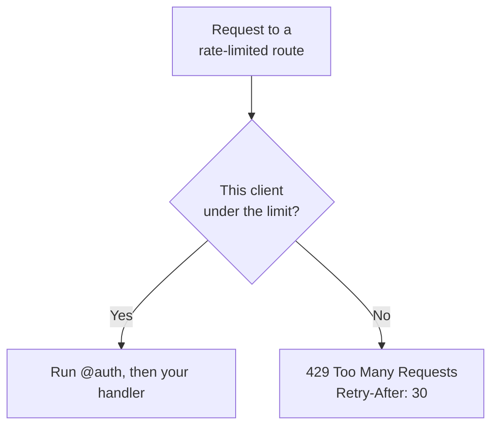

# Rate limiting

**Rate limiting caps how often one client can call a route.** You add the `@ratelimit` decorator to a route, and the edge rejects a client that goes over the limit **before your code runs**.

## Why you want it

Some routes are attractive to abuse. A login route invites password guessing (a "brute-force" attack: trying thousands of passwords). A "send me a code" route invites spam. A public write endpoint invites floods. Rate limiting puts a hard ceiling on how fast any single client can hammer a route, so an attacker cannot try millions of guesses and a script cannot drown your app.

Because it runs at the edge before your handler (and before the auth check), an over-the-limit request costs you almost nothing: your WebAssembly code never even wakes up.

## How: the `@ratelimit` decorator

Put it above a route, alongside the verb decorator (`@get`, `@post`, and so on):

```ts
import { Response, RouteContext } from 'toiljs/server/runtime';

@rest('auth')
class Auth {
    // At most 5 login attempts per 60 seconds, per client.
    @ratelimit(RateLimit.SlidingWindow, 5, 60)
    @post('/login')
    login(ctx: RouteContext): Response {
        // ...only runs if the caller is under the limit...
        return Response.text('ok\n');
    }
}
```

The shape is `@ratelimit(strategy, limit, window)`:

- **`strategy`** is a `RateLimit` value: `RateLimit.FixedWindow`, `RateLimit.SlidingWindow`, or `RateLimit.TokenBucket`. It is an ambient global, so you do not import it.
- **`limit`** and **`window`** are two whole numbers. Their exact meaning depends on the strategy (see the table below). For the window strategies, it reads as "at most `limit` requests per `window` seconds".

Both numbers must be plain integer literals. A malformed decorator emits no guard at all (it fails safe) rather than compiling something wrong, the same rule as [`@cache`](./caching.md).

## What a rejected request looks like

When a client is over the limit, the edge returns **`429 Too Many Requests`** with a **`Retry-After`** header telling the client how many whole seconds to wait before trying again. Your handler does not run.



A `429` is the standard "slow down" status. A well-behaved client library will read `Retry-After` and back off automatically.

## The three strategies

A **window** is a slice of time the limiter counts within. The strategies differ in how they draw those slices.

| Strategy | `limit`, `window` mean | Behavior |
| --- | --- | --- |
| `FixedWindow` | `limit` events per `window` seconds | Cheapest. Counts in fixed wall-clock buckets (for example, each minute on the clock). A caller who times a burst around a bucket boundary can briefly get up to ~2x `limit` across two adjacent buckets. |
| `SlidingWindow` | `limit` events per `window` seconds | Smooths that boundary spike by weighting the previous window. **The best general choice** for "N per period". |
| `TokenBucket` | `limit` = burst size, `window` = refill rate **per second** | Allows an initial burst of up to `limit`, then refills at a steady `window` tokens per second. Good for APIs that are bursty but must stay bounded on average. |

Examples:

```ts
// 100 requests per minute, smoothed. A good default for a public API.
@ratelimit(RateLimit.SlidingWindow, 100, 60)

// Burst of 20, then 5 per second sustained.
@ratelimit(RateLimit.TokenBucket, 20, 5)

// Exactly 3 per hour, cheapest counting.
@ratelimit(RateLimit.FixedWindow, 3, 3600)
```

If you are unsure, use `SlidingWindow`. It behaves the way people intuitively expect "N per period" to behave.

## How a client is identified

By default the limiter keys on the **client IP address**: specifically the network peer address the edge actually observed, not a header like `X-Forwarded-For` (which a client can forge). That is what makes this a real abuse control: a caller cannot reset their own bucket by lying in a header.

The count is **exact across all of the edge's workers**: a given IP always maps to one authoritative place that keeps the count, so the limit is global for the route, not per worker. And each rate-limited route has its **own independent limiter**: a limit on `/login` does not eat into `/signup`'s budget.

Only routes that opt in with `@ratelimit` pay any cost; everything else runs on the untouched fast path.

## Worked example: protecting login and a write route

Login is the classic case. This mirrors what the built-in auth system does for you (`register` and `login` already carry `@ratelimit(SlidingWindow, 5, 60)`), so you rarely have to add it there yourself. See [Using auth](../auth/usage.md).

For your own sensitive routes, the pattern is the same. Here a public "post a comment" endpoint is both rate-limited and auth-guarded:

```ts
import { Response, RouteContext } from 'toiljs/server/runtime';

@rest('comments')
class Comments {
    // 10 comments per minute per client, and you must be logged in.
    @ratelimit(RateLimit.SlidingWindow, 10, 60)
    @auth
    @post('/')
    create(ctx: RouteContext): Response {
        // Runs only if the caller is under the limit AND authenticated.
        return Response.text('posted\n');
    }
}
```

The order is fixed and safe: rate limiting runs **first** (so even unauthenticated floods are capped), then the `@auth` guard, then your handler. You do not manage that ordering.

## Choosing a limit

- **Login / signup / "send a code":** keep it tight. 5 to 10 per minute per client is plenty for a human and painful for a guesser.
- **Public read APIs:** a `SlidingWindow` of 60 to 300 per minute is a reasonable starting point; raise it if legitimate clients hit it.
- **Bursty clients (dashboards that fire several calls on load):** consider `TokenBucket` so a short burst is allowed but the sustained rate stays bounded.
- Start conservative and loosen if you see legitimate users getting `429`s. It is easier to relax a limit than to recover from an abuse incident.

## Gotchas and current limits

- **Route-level only.** Put `@ratelimit` on each route you want limited. There is no controller-wide form yet (unlike `@auth`, which you can put on a whole class).
- **Keyed on IP today.** The decorator keys on the client IP. Users behind a shared IP (a corporate network, a mobile carrier gateway) share a bucket, so do not set login limits so low that a busy office trips them. A per-user key (limiting by account instead of IP) exists in the runtime but is not yet exposed through the decorator.
- **`TokenBucket`'s second number is a rate, not a duration.** For the bucket, `window` means "tokens refilled per second", not "seconds". Re-read the table if it surprises you.
- **Same behavior in dev.** `toiljs dev` runs a single-process mirror of all three strategies, so a limited route behaves the same locally as on the edge.

## Related

- [Auth, sessions, and `@user`](../auth/usage.md): `@ratelimit` runs before the `@auth` guard, so it protects the login itself.
- [Email](./email.md): pair `@ratelimit` with email triggers (verification codes, password resets) to blunt abuse.
- [Caching](./caching.md): the other pre-handler guard; both fail safe on a malformed decorator.
- [Every decorator](../concepts/decorators.md).
