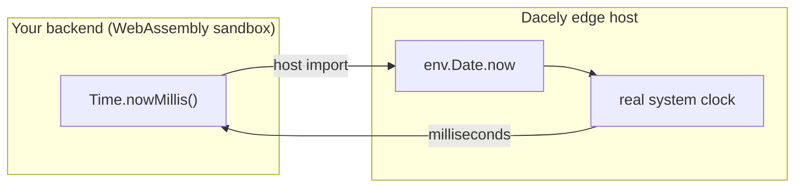

# Time

**`Time` is the edge's clock: the blessed way to read the current time in your backend.** It gives you the number of milliseconds or seconds since a fixed reference point, so you can stamp events and compute expiries.

## How to use it

`Time` is an ambient global (no import needed), and is also exported from `toiljs/server/runtime`:

```ts
const ms = Time.nowMillis();   // milliseconds since the Unix epoch (a u64)
const s  = Time.nowSeconds();  // whole seconds since the Unix epoch (a u64)
```

| Member | Returns | Description |
| --- | --- | --- |
| `Time.nowMillis()` | `u64` | Milliseconds since the **Unix epoch** (midnight UTC on 1 January 1970). This is the same value as JavaScript's `Date.now()`. |
| `Time.nowSeconds()` | `u64` | Whole seconds since the epoch (`nowMillis() / 1000`). This is the unit sessions and login challenges use. |

The **Unix epoch** is just the agreed "time zero" that computers count from. "Milliseconds since the epoch" is a single number that unambiguously names an instant, with no time zone to worry about.

## Why time is a "host import" (and what that means)

Your backend runs as a **WebAssembly** module: a small, sandboxed program. A sandbox is deliberately sealed off from the outside world. It has no clock of its own, no network, no files, nothing except the memory it was given and a short list of functions the host chooses to hand it. Each of those handed-in functions is called a **host import**.

This is on purpose. WebAssembly aims to be **deterministic**: given the same inputs, the same code produces the same outputs, every time. That makes it safe to run untrusted code, easy to cache, and easy to reason about. But the current time is not deterministic: it is different every time you ask. So a WebAssembly module cannot just "know" the time; it has to **ask the host** for it. Reading the clock is a call across the sandbox boundary.

`Time` is the thin, friendly wrapper over that call. Under the hood it uses the host's `Date.now()` binding (`env.Date.now`).



Both the edge and the dev server provide this binding, so time behaves **identically** in `toiljs dev` and in production.

## `Time` vs calling `Date.now()`

ToilScript's `Date.now()` lowers to the exact same host import, so you *can* call it directly. Prefer `Time`:

- It makes the host boundary (and the single millisecond unit) explicit and easy to find in a codebase.
- It gives you `nowSeconds()` without writing an open-coded `/ 1000` at every call site.

Both are the same clock, so timing you do in a handler lines up with timing the framework does. For example, the auth system uses `Time.nowSeconds()` for session issue and expiry times.

## Correct usage: timestamps and TTLs

`Time` is **wall-clock time**, exactly like a browser's `Date.now()`. It follows the system clock, which means it can occasionally **step backward** (for instance when the machine corrects its clock against a time server).

Do:

- **Stamp an instant.** Record when something happened, so you can compare it later: an event time, a "last seen" marker.
- **Compute an expiry (a TTL).** A **TTL** ("time to live") is a deadline. You set it by adding a duration to *now*, and you check it by comparing *now* against the stored deadline:

```ts
const ttlSeconds: u64 = 3600;                 // valid for one hour
const expiresAt = Time.nowSeconds() + ttlSeconds;

// ...later, on another request...
const expired = Time.nowSeconds() >= expiresAt;
```

Do not:

- **Measure elapsed time with it.** Do not use it as a stopwatch to time how long an operation took. Because the wall clock can step backward, `end - start` could come out zero or negative. `Time` answers "what instant is it now?", not "how much time has passed?".

## Gotchas

- **It is wall-clock, not monotonic.** It can jump backward across a clock correction. Fine for timestamps and expiries; wrong for measuring durations.
- **Milliseconds vs seconds.** `nowMillis()` and `nowSeconds()` differ by a factor of 1000. Mixing them (comparing a millisecond stamp to a second stamp) is a common bug. Sessions and login challenges use **seconds**.
- **UTC only.** These are epoch counts, with no time zone. Format for display on the client if you need a local time.

## Related

- [Auth, sessions, and `@user`](../auth/usage.md): sessions use `Time.nowSeconds()` for their issue and expiry stamps.
- [Caching](./caching.md): TTLs are the same idea, a deadline after which a saved value is stale.
- [Compute tiers](../concepts/tiers.md): more on the WebAssembly sandbox your backend runs in.
